# Harness Engineering · Mini Harness 深度读书笔记

> **MarkText 宽屏阅读版**：流程图均为静态 PNG，并按图形比例重新缩放，避免流程图在正文中占比过大。为了获得设计时的正文/图片比例，请在 MarkText 中使用文档同目录 `README_显示设置.txt` 里的推荐显示参数。

> 这份笔记不是对课件代码的逐行摘抄，而是把整套 Mini Harness 的知识重新组织成一条可以独立阅读的工程逻辑。目标不是记住 `progress.md`、`json.dumps()`、`pytest` 参数或某个框架的具体 API，而是理解：**一个 LLM 为什么需要 Harness，Harness 的各个机制分别解决什么问题，它们之间怎样组合，以及哪些教学结论在生产环境里需要更精确地理解。**

---

## 0. 先建立全局认知：Harness 到底是什么

最简单的 LLM 应用通常是：

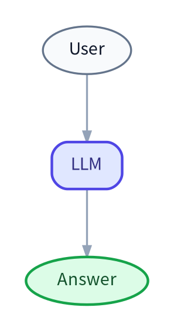

但真正的 Agent 任务往往不是“一问一答”，而是一个需要反复行动的过程：模型要读取信息、调用工具、根据结果继续判断、修复错误，直到任务结束。于是最小 Agent 形态变成：

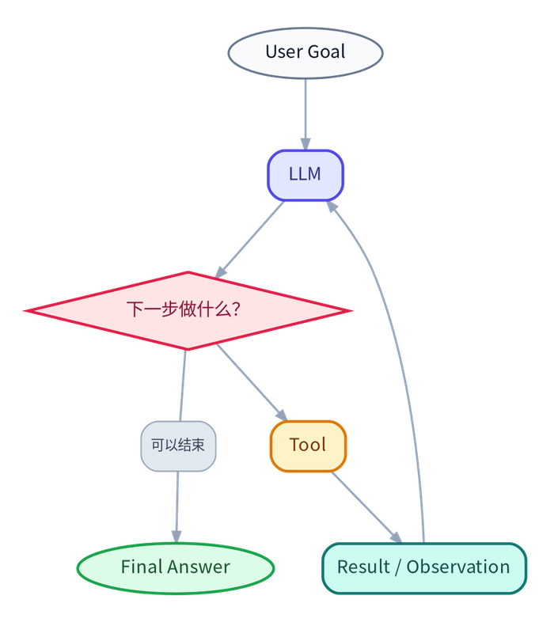

问题是：**只要开始循环，新的工程问题就会出现。** Agent 可能无限循环，工具可能失败，历史 Context 会越来越大，模型可能忘记任务做到哪里，可能自称“已经完成”但实际上结果错误，也可能调用危险工具、创建过多子 Agent 或消耗超出预期的 Token 和费用。

Harness 的作用，就是在模型周围增加一层**执行、状态、质量、编排和治理基础设施**。它主要不是让底层 LLM “智商突然变高”，而是让模型的能力变得：

- 可以反复执行，而不是只回答一次；
- 可以操作真实外部系统；
- 可以保存必要状态，而不是只依赖聊天历史；
- 可以控制 Context，而不是越跑越乱；
- 可以验证结果，而不是让模型自己宣布成功；
- 可以拆任务并隔离复杂子任务；
- 可以被观察、被阻止、被限额。

整套 Mini Harness 可以先粗略理解成五层：

| 层 | 解决的问题 | 主要机制 |
| --- | --- | --- |
| Execution | Agent 怎么行动并继续行动？ | Agent Loop、Tool Use |
| Context & State | Agent 应该看到什么、当前做到哪里？ | Progress、Context Management、Feature List |
| Quality | 怎么证明结果正确或质量足够？ | Verification、Generator-Evaluator |
| Orchestration | 复杂任务由谁做、怎么拆开做？ | Feature Decomposition、Subagents |
| Governance | 怎么让 Agent 安全、可控、可观察？ | Hooks、Permission、Budget、Tracing |

后面的所有章节，实际上都是在逐步把一个简单的 `LLM → Tool → LLM` 循环升级成这个工程系统。

## 阅读导航

| 章节 | 核心问题 |
| --- | --- |
| 第一章 | Harness 各模块为什么要解耦？ |
| 第二章 | Agent 怎么循环、怎么真正调用工具？ |
| 第三章 | 怎么记录过程，以及 Progress 为什么不等于断点续跑？ |
| 第四章 | Context 为什么会溢出、腐烂，应该怎样控制？ |
| 第五章 | 为什么要把任务状态从聊天历史里外置？ |
| 第六章 | Agent 做完以后，凭什么证明做对了？ |
| 第七章 | 复杂子任务怎样隔离 Context，预算为什么会放大？ |
| 第八章 | 生成与评审为什么要分离，和 Verification 有什么区别？ |
| 第九章 | Hooks、Permission、Budget 怎样组成治理层？ |
| 第十章 | Harness 的成本到底换来了什么？ |
| 第十一章 | 如何把 11 个机制收束成可迁移的架构思维？ |

### 本章 Takeaways

1. Harness 不是另一个“大模型”，而是围绕模型建立的执行与控制层。
2. Agent 一旦进入多步循环，Context、State、Verification、Safety、Cost 等问题就会同时出现。
3. 学习 Harness 的重点不是背 Python 实现，而是知道每个机制解决哪一种 Failure Mode。
4. 最终应该形成五层思维：Execution、Context & State、Quality、Orchestration、Governance。

---

# 第一章：项目骨架与共享配置——先看系统，而不是文件

Mini Harness 的课程代码把不同职责拆成多个模块：核心循环和 Tool Use 在 `core.py`，Context、Progress、Planner、Verifier、Subagent、Evaluator、Hooks 等分别放在独立文件里，另外有共享配置对象和 E2E 脚本。

真正值得学习的不是“总共有几个 `.py` 文件”，而是这种结构背后的原则：

```text
核心执行逻辑应该稳定，横向能力应该尽量解耦。
```

例如 `max_steps`、模型名、Context 阈值、Token/Cost 限额等都属于 Harness Policy。如果这些参数散落在不同函数里，后面很难统一调整；共享配置对象的价值，就是把这类运行约束集中管理。

可以把系统想成：

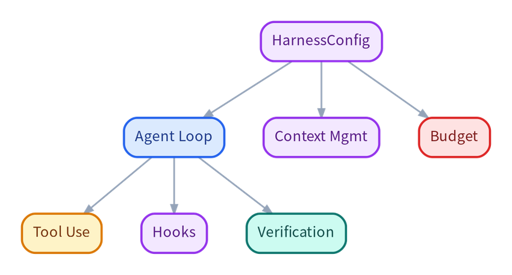

因此第一章只需要留下一个工程认识：**配置是 Policy，模块是 Capability，Agent Loop 是执行核心。** 后面所有机制都围绕这三个角色展开。

### 本章 Takeaways

1. 不需要背项目目录；要看懂职责为什么要拆开。
2. HarnessConfig 的意义是集中表达运行策略，而不是某个 `dataclass` 写法。
3. 后面的机制应该尽可能作为可替换能力接入，而不是全部硬编码进主循环。

---

# 第二章：Agent Loop + Tool Use——Harness 的执行心脏

## 2.1 Agent Loop：从“一次回答”变成“持续执行”

Agent Loop 解决的是最底层问题：**复杂任务不可能总靠一次模型调用完成。** 模型需要根据最新 Observation 决定下一步，所以 Harness 必须不断重复“调用模型 → 执行动作 → 回传结果”。

课程把循环描述为四个阶段：

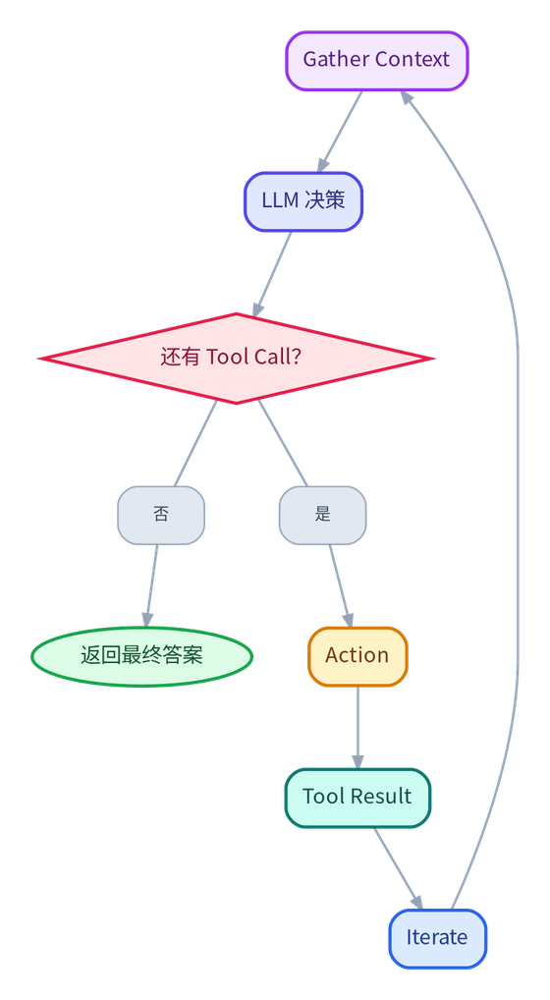

### Gather：模型看到的不只是用户最后一句话

每轮 LLM 调用都会收到当前 `messages` 和 Tool Schema。`messages` 是不断增长的工作历史：原始任务、模型的 Tool Call、工具结果以及后续推理都会逐渐进入这里。

因此 `messages` 并不是普通聊天记录，而是 Agent 当前工作的**动态工作记忆**。后面为什么需要 Context Management，也正是因为它会不断变大。

### Verify：这里验证的只是“模型是否还想调用工具”

教学代码的实际退出逻辑是：

```text
如果本轮 response 没有 tool_calls
→ 返回模型的普通文本
→ Agent Loop 结束
```

这意味着一个非常重要的边界：

```text
“没有 Tool Call”只代表模型认为自己可以回答，并不代表任务已经被客观验证为正确。
```

因此第二章这里的 `Verify` 更准确地说是“退出判断”，不是第六章那种真正的 Verification。

### Action：Tool Call 与 Tool Result 必须成对出现

模型如果要求调用工具，Harness 不能只执行工具然后把结果扔进 Context。它必须先保留模型产生的 Tool Call，再把 Tool Result 以匹配的 `tool_call_id` 回写。

逻辑上相当于：

```text
Assistant:
“执行工作单 #A：调用 search_file(...)”

          ↓

Tool:
“工作单 #A 的结果：...”
```

`tool_call_id` 可以理解成一张工作单编号，用来确保“这个结果到底对应哪一个请求”。如果只保留结果而没有前面的 Tool Call，请求与结果之间就失去了关联。

### Iterate：循环必须带硬刹车

Agent 可能因为模型判断错误、工具失败或 Prompt 设计问题不断重复，因此 Loop 外围一定要有 `max_steps` 一类上限：

```text
LLM → Tool → LLM → Tool → ...
                 ↓
            达到 max_steps
                 ↓
                STOP
```

`max_steps` 是最基本的安全熔断器，但它只是第一层。后面还会加入 Token、Cost、Time、Subagent Depth 等更细的 Resource Budget。

---

## 2.2 Tool Use：模型不是直接“拿到 Python 函数”

LLM 要正确调用工具，需要两个东西：

1. **工具契约**：这个工具叫什么、做什么、需要什么参数；
2. **工具执行结果**：调用成功还是失败，返回了什么。

### Tool Schema 是模型使用工具的“说明书”

Function Calling API 通常不会把一个可执行 Python 函数对象直接交给模型，而是把类似 JSON Schema 的描述发送给模型：

```text
Tool Name
Description
Parameters
Required Fields
Types
```

因此真正应该记住的是：

```text
代码负责执行，Schema 负责告诉模型“怎么调用”。
```

课程用 `inspect.signature()` 自动从 Python 函数签名生成简化 Schema，这是很好的教学方式，但不要把它误认为完整生产方案。简单的 `str/int/list/dict` 映射无法完整覆盖 `Optional`、`Union`、`Literal`、Enum、嵌套对象、约束、复杂泛型等情况。生产环境通常会使用成熟 Schema/Pydantic 体系。自动生成 Schema 的价值是**减少代码与调用契约漂移**，但它也不能保证“100% 同源就一定正确”：缺失的 docstring、错误的类型注解、业务语义约束仍然可能让 Schema 不完整。

另外，“LLM 完全看不懂 Python，只认识 JSON Schema”也不应理解得太绝对。如果 Python 源码本身被放进 Context，模型当然可以阅读；这里真正的意思是：**Function Calling 协议使用 Schema 作为正式调用契约，而不是把 Python 对象本身传给模型。**

### 结构化错误回传：错误不能被吞掉

工具执行失败时，最危险的两种做法是：

```text
异常直接把整个 Agent 打崩
```

或者：

```text
try/except 后静默吞掉
→ LLM 误以为动作成功
→ 在错误前提上继续推理
```

更好的方式是把错误变成 Observation：

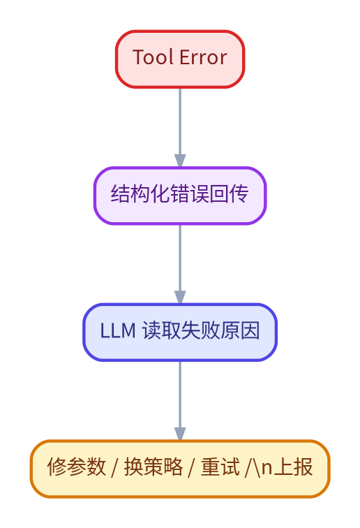

这让错误进入 Agent Loop，而不是脱离 Loop。教学版 Dispatcher 在成功时可能直接透传普通字符串、非字符串结果再 JSON 序列化，因此“所有成功结果都必须是 JSON”也不是这个实现的真实规则；生产环境是否统一成结构化 Envelope，应由工具契约设计决定。

但仍需注意：教学代码里用一个宽泛 `except Exception` 把所有错误包装成字符串，适合演示，不等于生产级错误治理。真实系统通常还需要区分：

- retryable / non-retryable；
- permission / validation / timeout / network / business error；
- 是否需要重试、退避、人工介入；
- 哪些错误信息可以返回给模型，哪些需要脱敏。

课程代码还有一个实现层提醒：如果统计变量（例如 `total_tokens`）初始化后没有在每轮正确累加，那么最终报表并不可靠。这个问题不影响 Loop 概念，但说明**Observability 指标本身也必须被验证**。

### 本章 Takeaways

1. Agent Loop 的本质是 `LLM → Action → Observation → Iterate`，而不是一次长 Prompt。
2. “没有 Tool Call”只是模型认为可以结束，不等于客观验证通过。
3. `messages` 是不断演化的工作 Context，因此后续必然需要 Context Management。
4. Tool Schema 是模型调用工具的契约；可执行函数仍由 Harness 执行。
5. Tool Call 与 Tool Result 必须通过 ID 正确关联。
6. 结构化错误回传的核心价值是让失败成为下一轮推理的 Observation。
7. `max_steps` 是 Agent Loop 最基础的硬刹车。

---

# 第三章：Progress Tracking、Persistence 与真正的 Resume

## 3.1 ProgressTracker 真正解决的是什么

Agent 跑得越久，越需要知道：

```text
“刚才到底发生了什么？”
```

ProgressTracker 通过生命周期事件把 Session 开始、Tool Call、Session 结束等信息写入持久化介质。教学实现使用 `progress.md`，但真正重要的是这个抽象：

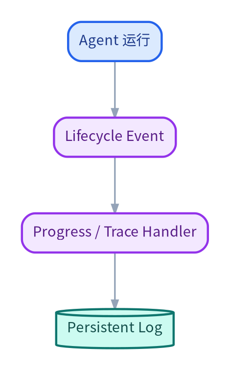

因此 ProgressTracker 的第一价值是：

```text
Observability + Audit Trail。
```

它像 Agent 的“黑匣子”。如果任务失败，可以看到它搜索过什么、工具在哪一步报错、是否出现重复调用、最后停在哪里，而不是只得到一句“Agent failed”。

---

## 3.2 Progress Tracking 不等于断点续跑

这是这一章最重要的修正。

假设任务是“总结 10 篇 PDF”：

```text
PDF1 → 已生成完整总结
PDF2 → 已生成完整总结
PDF3 → 正在处理
        ↓
      进程崩溃
```

如果 PDF1、PDF2 的完整总结只存在于内存里的 `messages`，而 `progress.md` 只写了：

```text
PDF1 completed
PDF2 completed
```

重启后，你只知道“做过”，却拿不到之前真正生成的完整结果。

所以四个概念必须彻底区分：

| 概念 | 回答的问题 | 示例 |
| --- | --- | --- |
| Progress / Event Log | 发生过什么？ | “PDF1 已处理” |
| Artifact Persistence | 已经产出了什么？ | `pdf1_summary.md` |
| Checkpoint | 当时整个可恢复状态是什么？ | messages、graph state、pending action、IDs |
| Resume / Durable Execution | 怎么利用保存状态真正接着执行？ | 从 PDF3 继续，并重新加载已保存成果 |

正确的长任务设计更像：

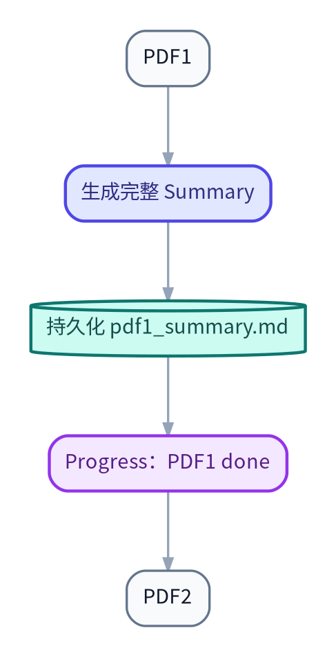

这样崩溃后：

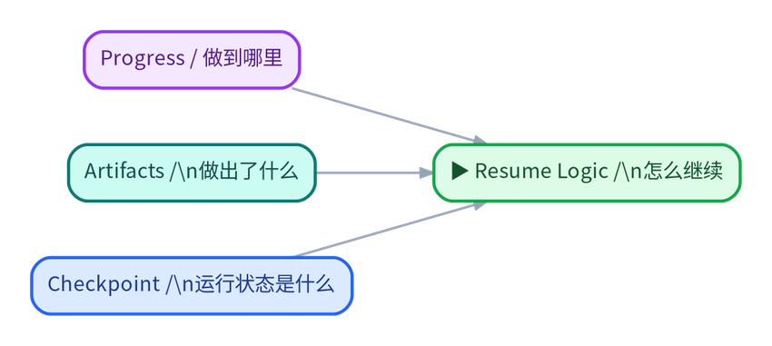

所以 `progress.md` 更准确地说是**持久化执行轨迹**，而不是完整 Checkpoint。它可以为 Recovery 提供线索，但不能单独实现确定性的 breakpoint resume。

---

## 3.3 Progress 与 Memory：不要混成一个概念

课程把 Memory 粗略分成事实层、历史层、画像层，这个分层可以作为理解入口：

- **事实层**：当前任务做过什么、哪些步骤完成；
- **历史层**：跨 Session 可检索的历史行为；
- **画像层**：长期偏好、项目规则、稳定用户/环境信息。

但不要拘泥某些产品文件名或实现方式。真正重要的是：

```text
Persistence 是“数据活下来”，Memory 是“哪些信息值得存、怎样找回来、什么时候重新注入 Context”。
```

因此 Memory 建立在 Persistence 之上，但两者并不相同。

---

## 3.4 ProgressTracker 为什么适合通过 Hook 接入

Progress 属于典型的 Cross-cutting Concern：Agent Core 不应该到处写：

```text
write_progress()
write_metrics()
write_trace()
```

更好的方式是：

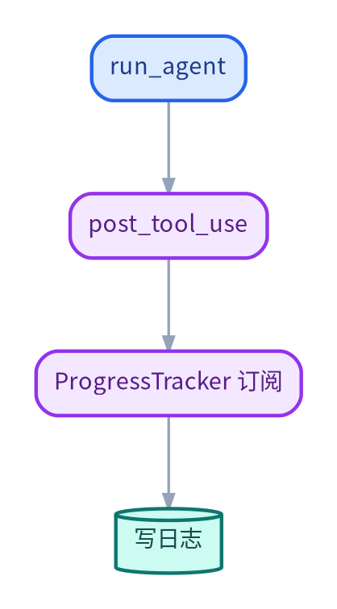

于是 Agent Core 只负责运行，而 Progress 模块负责记录，两者解耦。这为第九章 Hooks 铺好了路。

### 本章 Takeaways

1. Progress Tracking 的主要价值是“发生过什么”，也就是 Observability / Audit。
2. `progress.md` 只是教学存储形式，不是机制本身。
3. Progress Log 不能自动恢复已经丢失的完整中间产物。
4. 必须区分 Progress、Artifact Persistence、Checkpoint、Resume。
5. 真正的 Durable Execution 需要持久化状态 + 持久化成果 + 恢复逻辑。
6. Persistence 让数据活下来；Memory 决定存什么、找什么、什么时候重新注入。

---

# 第四章：Context Management——不是“能塞多少”，而是“应该让模型看到多少”

Agent Loop 每执行一轮，`messages` 都可能增加 Tool Call、Tool Result、错误信息和新的推理结果。长任务因此会遇到两种完全不同的问题。

## 4.1 Context Overflow 与 Context Rot

### Context Overflow：装不下

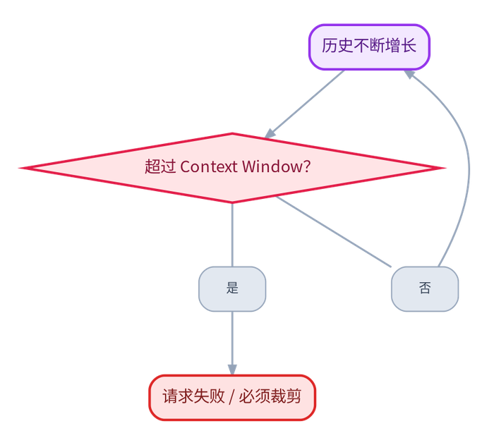

这是容量问题。

### Context Rot：装得下，但越来越乱

即使模型支持非常大的 Context，也不意味着把所有历史都塞进去就会更好。旧日志、重复 Tool Result、过时假设、已经被推翻的方案会降低有效信息的 Signal-to-Noise Ratio：

```text
更多 Context
≠
更多有效信息
```

于是 Agent 可能：

- 忘记真正目标；
- 被旧结论干扰；
- 重复已经做过的搜索；
- 在大量工具日志里找不到当前关键证据。

所以 Context Engineering 的核心目标应该记成：

```text
Minimum Sufficient Context，而不是 Maximum Context。
```

---

## 4.2 Head + Summary + Tail：一种容易理解的压缩模式

课程的教学策略是：

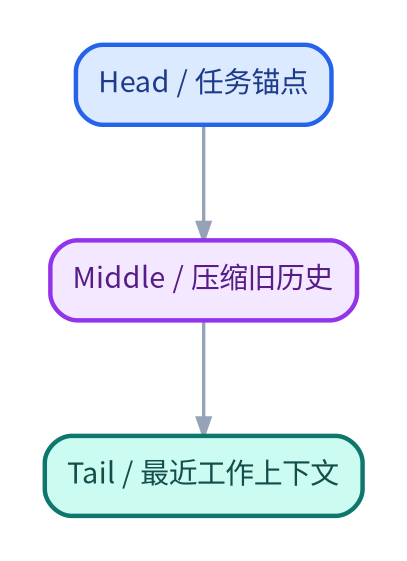

可以记成一句话：

```text
目标不能忘，当前不能断，历史可以压。
```

具体的“前 2 条、后 6 条”只是 Demo 参数，不需要背。真正值得理解的是信息分类：

- Head：长期稳定的目标、系统约束、关键任务定义；
- Tail：当前正在工作的局部上下文；
- Middle：已经发生但不再需要逐字保留的历史过程。

而且好的 Middle Summary 不应只是“调用过几个工具”，更应该保留：

- 已确认的重要事实；
- 被排除的假设；
- 做过的关键决策；
- 修改了什么；
- 测试/验证结果；
- 仍未解决的问题。

否则压缩可能把“最值得保留的因果信息”一起压掉。

课程用字符数粗略估 Token 只是教学手段。生产环境应尽量使用与具体模型相匹配的 Tokenizer / Count API。尤其中文不能简单照搬英文的“4 characters ≈ 1 token”经验。

---

## 4.3 Prompt Cache：稳定前缀是原则，不是绝对铁律

Prompt Cache 与 Context Compression 是两个问题：

```text
Compression
→ 这次到底发送多少 Context？

Prompt Cache
→ 重复发送的前缀能否复用计算？
```

为了提高 Cache Hit，通常希望大的、稳定的内容尽量稳定，例如系统规则、长期工具契约等。但是“运行过程中绝对不能改 Tools / Memory / System Prompt”不应当当作普遍铁律。

真实工程存在明显 Trade-off：

```text
Cache Stability
       vs
Context Relevance
```

例如：

- 永远把 100 个 Tool Schema 全塞在前面，可能有利于 Cache，但会增加 Tool Selection 噪音；
- 动态 Tool Routing 会改变工具集合，却可能显著减少 Context 和误调用；
- 永远注入全部 Memory 可能保持稳定，但相关性很差；
- 按需检索 Memory 会改变动态部分，却更符合任务需要。

更成熟的原则是：

```text
稳定内容尽量稳定，动态内容按相关性动态加载；不要为了 Cache Hit 牺牲 Context Quality。
```

常见结构可以是：

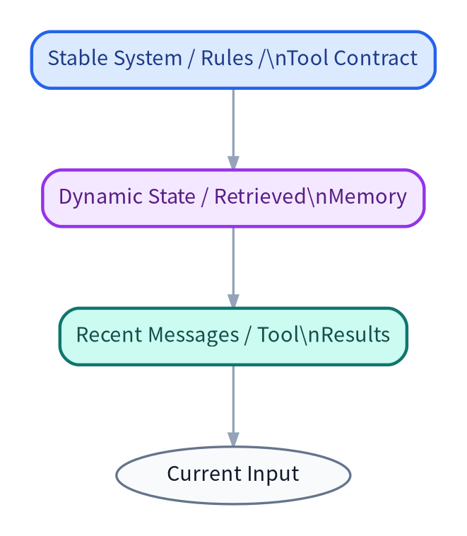

---

## 4.4 对抗 Context Rot 的三个方向

Context Rot 不是单靠“删历史”解决。前面几章会逐渐形成三条互补路线：

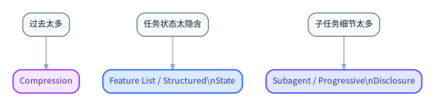

它们不是替代关系，而是分别从不同方向降低模型需要同时处理的信息复杂度。

### 本章 Takeaways

1. Overflow 是容量问题；Rot 是信息质量问题，两者不能混为一谈。
2. Head + Summary + Tail 是一种模式，不是固定的 `2 + 6` 参数。
3. 压缩的目的不仅是省 Token，更是提高 Signal-to-Noise Ratio。
4. Prompt Cache 关注前缀复用；Context Management 关注该不该发送这些信息。
5. 稳定前缀是优化原则，不应该压倒动态 Tool Routing 和 Relevant Memory 的价值。
6. Context Engineering 的核心目标是 Minimum Sufficient Context。

---

# 第五章：Feature List——把 Task State 从聊天历史里拿出来

## 5.1 真正的问题：不要让模型“回忆自己做到哪了”

复杂任务如果只依赖自然语言历史，模型每一轮都要重新推断：

```text
我现在整体任务是什么？
哪些已经完成？
哪些失败了？
下一步是什么？
```

这些其实不是应该反复推理的知识，而是应该直接保存的状态。

Feature List 的核心不是“做一个漂亮 Todo UI”，而是：

```text
把隐含在 Context 里的 Task State，变成显式 Structured State。
```

例如：

```text
[completed]   分析需求
[completed]   定位数据库问题
[in_progress] 修复连接池
[pending]     运行测试
[pending]     更新文档
```

模型不需要从几十轮消息里猜“我做到哪”，直接读取当前状态即可。

这体现了一个非常重要的 Agent Engineering 原则：

```text
不要让 LLM 推理本可以直接存储的事实。
```

同样的思路也适用于 Permission State、Approval State、Workflow State 等。

---

## 5.2 好的 Feature 应该是可执行、可验证的工作单元

Feature 不应该写成：

```text
“把系统变好”
```

而应该尽量满足：

- 单一职责；
- 有明确完成条件；
- 能被验证；
- 依赖关系清楚。

例如：

```text
修复 /chat 连接超时，并使 test_chat_timeout.py 通过
```

比：

```text
优化聊天模块
```

更适合作为 Agent Task State。

最简单的状态机是：

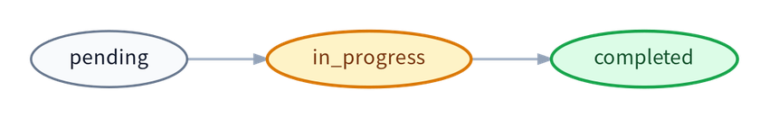

生产环境还可能需要：

```text
blocked
failed
retrying
cancelled
waiting_for_approval
```

以及 `depends_on`、owner、priority、deadline 等字段。

---

## 5.3 Replace / Merge / Query 背后的真正含义

课程的 `todo_tool` 提供 Replace、Merge、Query 三种模式，具体 Python 实现并不重要。它们表达的是三个 Workflow 动作：

```text
Replace
→ 初始化 / 重建计划

Merge
→ 更新已有任务或动态追加新任务

Query
→ 读取当前任务快照
```

其中 Merge 特别重要，因为真实 Agent Planning 不应该被理解成：

```text
开局制定一次计划
→ 永远照着执行
```

而应该允许：

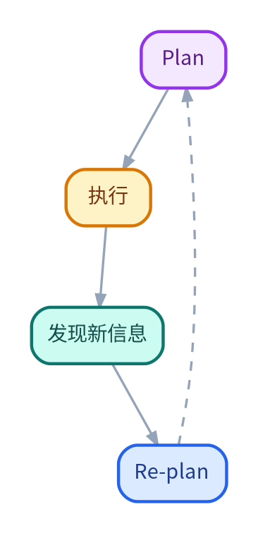

因此 Feature List 是一个**可更新的外部状态系统**，而不是静态清单。

---

## 5.4 Feature List 不等于 Context Compression

这是最容易误解的地方。

如果所有 Tool Result 仍然不断写入同一个 `messages`，即使有 Todo List：

```text
messages
仍然会持续增长
```

所以 Feature List 不能自动解决 Context Overflow。

两者分别回答：

```text
Compression
→ 旧历史太多怎么办？

Feature List
→ 当前任务状态和下一步是什么？
```

Feature List 的主要价值是减少 Planning Burden 和 Context Rot，而不是自动让 Context 变短。

进一步区分 ProgressTracker：

```text
Progress / Log
→ 过去发生了什么？

Feature State
→ 现在是什么状态，接下来做什么？
```

Log 通常持续增长；State 更接近“当前快照”。

---

## 5.5 真正的 Feature-level Isolation 还需要更多机制

理想流程是：

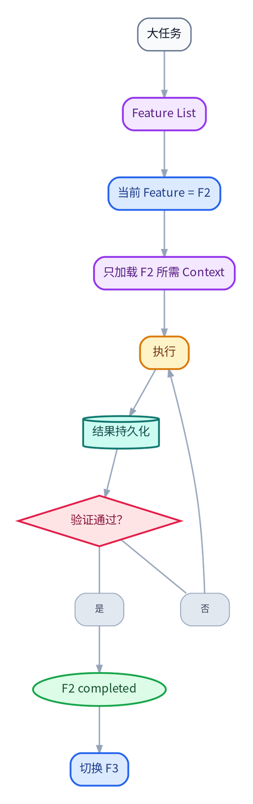

要做到这一点，还需要 Context Management、Subagents、Artifact Persistence、Checkpoint/State 等机制配合。

教学版用进程内 List 保存 TODO，只适合说明机制；进程一退出，State 就消失。生产级 Task State 也不是“把 List 换成数据库”就结束了，通常还要考虑：持久化、依赖关系、失败/重试、Timeout、Cancellation、并发更新、Idempotency、Locking、Human Approval、Recovery 和 Observability。也就是说，Feature List 真正演进下去会变成一个小型 Workflow State System。

另外，不要把“频繁 Todo Tool Call”本身当成优点。每次工具调用都有 Token、Latency 和状态迁移成本。简单任务完全没必要引入完整 Feature List。

### 本章 Takeaways

1. Feature List 的核心是 Externalized Task State，不是 Todo UI。
2. 显式状态不应让 LLM 每轮从长历史中重新推断。
3. Feature 应尽量单一、可执行、可验证、依赖清楚。
4. `pending → in_progress → completed` 是最小状态机，生产环境会更丰富。
5. Feature List 不替代 Context Compression，也不自动实现 Context Isolation。
6. Progress 记录“过去发生了什么”；Feature State 表达“现在是什么、下一步做什么”。
7. 复杂计划应该允许 Re-planning，而不是开局计划一次后僵化执行。

---

# 第六章：Verification Loop——不要让 Agent 自己宣布“我做对了”

## 6.1 最关键的区别：Action Success ≠ Outcome Correct

假设 Agent 调用了：

```text
edit_file(...)
→ success
```

这只能证明：

```text
文件修改动作执行成功。
```

不能证明：

- 代码能运行；
- Bug 已经修复；
- 没有引入 Regression；
- 用户真正的 Acceptance Criteria 已满足。

所以：

```text
Tool Execution Success
        ≠
Task Outcome Correct
```

这是 Verification Loop 存在的根本原因。

---

## 6.2 它和第二章“结构化错误回传”不是同一层

第二章解决：

```text
Tool 本身有没有执行成功？
```

例如路径不存在、参数错误、网络异常。

第六章解决：

```text
Tool 成功执行后，产生的结果到底对不对？
```

例如 `edit_file` 成功，但 `pytest` 失败。

完整链条变成：

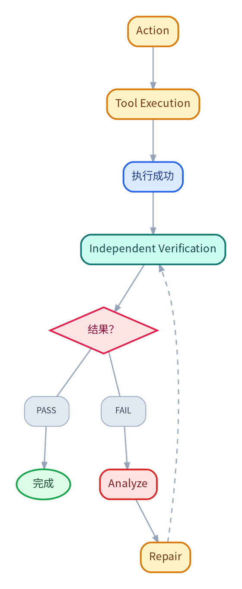

这就是所谓 Verification **Loop**，而不是“检查一次”。

---

## 6.3 Prompt 只能提醒“要验证”，不能代替验证

系统 Prompt 可以告诉模型：

```text
“在最终回答前主动验证。”
```

这个层的作用是 Verification Policy：提醒模型什么时候应该考虑验证。

但 LLM 完全可能在没有真实执行任何检查的情况下回答：

```text
“我检查过了，没有问题。”
```

因此真正产生 Evidence 的必须是外部可观察机制，例如：

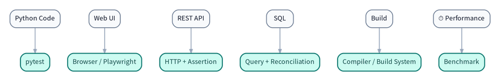

应该记住：

```text
LLM 负责 Reasoning；Verifier 负责 Evidence。
```

LLM Self-Review 仍然有价值，它可以发现明显逻辑问题、遗漏和坏味道，但它不能替代真实 Runtime / Environment 验证。

---

## 6.4 Verifier 的输出为什么要结构化

仅返回一句：

```text
“test failed”
```

对修复帮助有限。

更有价值的输出应该包含：

```text
passed / failed
exit_code
summary
failed tests
关键错误信息
```

于是模型可以根据证据定位原因并修复。

同时 Tool Result 也不能无限回传。例如测试日志几十万字符，全部塞入 Context 会重新引发 Context Rot。正确方向是：

```text
真实完整结果
   ↓
提取最相关诊断证据
   ↓
Minimum Sufficient Tool Result
   ↓
LLM
```

Timeout 同样非常重要。如果 Verifier 因死循环、阻塞 I/O 或异常环境一直不返回，整个 Agent 也会被卡死。因此 Verifier 本身也必须有 Failure Boundary。

---

## 6.5 Verification 不是 pytest，也不是绝对真理

`pytest` 只是 Coding Agent 的一个 Verifier。真正抽象应该是：

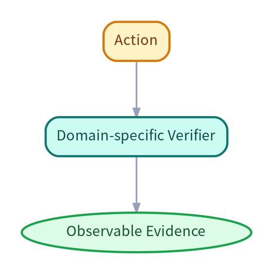

而且“测试通过”也不能被理解成“代码绝对正确”。它只能证明：

```text
当前测试覆盖到的 Acceptance Criteria 被满足。
```

如果测试遗漏 Security、Concurrency、Performance、Edge Case，Bug 仍可能存在。

所以 Verification 的质量取决于：

```text
Verifier Capability
+
Test / Acceptance Criteria Coverage
```

成熟系统还经常采用 **Layered Verification**：先跑便宜、快速的检查，再逐步升级到更昂贵的验证。

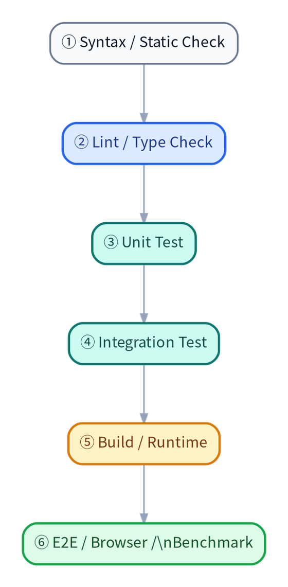

不一定每次都跑最贵的一层，而是根据变更范围、风险和 Acceptance Criteria 决定。比如“API 变快了”不能只看 Unit Test PASS，还需要 Benchmark；“UI 修好了”可能需要浏览器渲染或 DOM 断言。

也正因为如此，Agent 不应该为了“让测试通过”偷偷修改测试本身。否则它是在修改裁判，而不是修复选手。Verification 系统需要保护 Test / Specification / Acceptance Criteria 的完整性。

---

## 6.6 Verification Gate 与 Feature State 可以直接连接

上一章的 Feature：

```text
in_progress
```

什么时候能变成：

```text
completed
```

更合理的逻辑是：

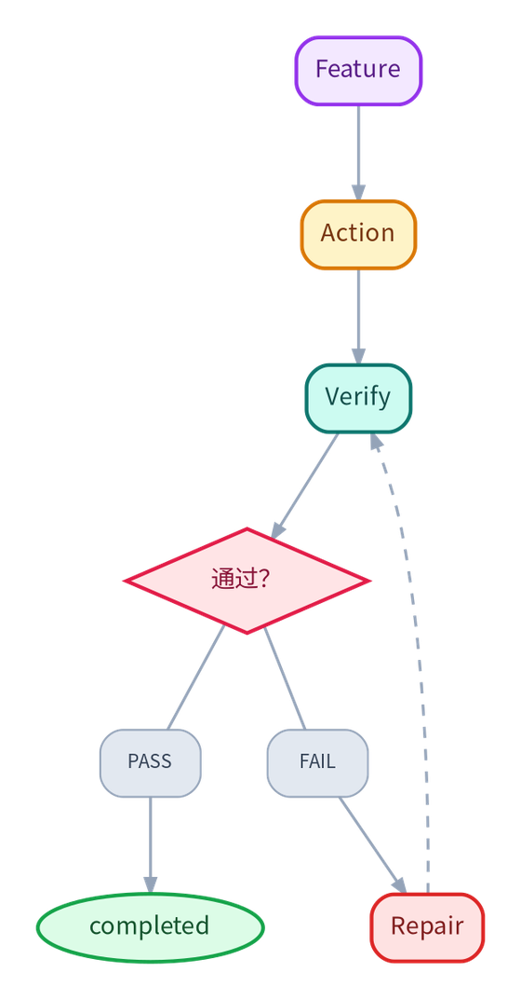

也就是：

```text
完成状态应该由 Evidence Gate 驱动，而不是由模型一句“做完了”驱动。
```

### 本章 Takeaways

1. Tool 执行成功不等于任务结果正确。
2. Structured Error Handling 处理执行失败；Verification 处理执行后结果是否满足目标。
3. Prompt 里的“请检查”只是 Verification Policy，不是真实 Evidence。
4. 核心闭环是 `Act → Verify → Fail → Repair → Re-verify`。
5. pytest 只是一个例子，Verifier 应按任务领域选择。
6. External Verification 比 LLM 自我声明可靠，但它仍受 Test Coverage 限制。
7. Feature 是否 completed，最好通过明确 Acceptance Criteria / Verification Gate 决定。

---

# 第七章：Subagents——给复杂子任务建立独立的 Context 与 Execution Boundary

## 7.1 Subagent 的第一价值：Context Isolation

假设一个父 Agent 同时分析 API、数据库、安全、测试、部署。如果全部放在一个 `messages`：

```text
API 细节
DB 细节
Security 搜索日志
测试失败与重试
Docker 输出
...
```

父 Agent 最终也许只需要五条结论，却要携带几十轮局部工作历史。

Subagent 把局部任务放进独立 Workspace：

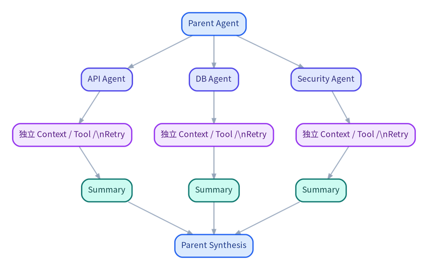

关键不是“Child 很聪明”，而是：

```text
Child 内部可以非常复杂，但 Parent 不需要继承全部复杂过程。
```

这和 Context Compression 的区别很清楚：

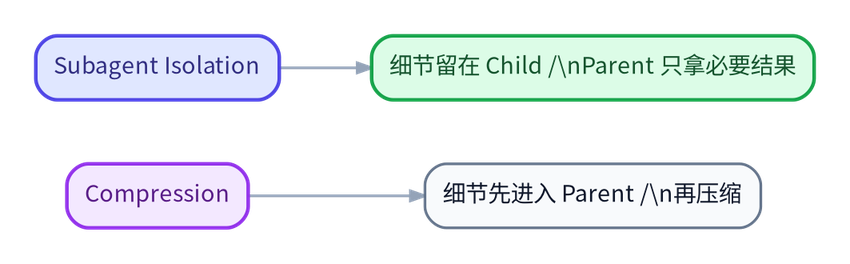

---

## 7.2 Progressive Disclosure：不是把父 Context 整包复制给 Child

Child 应该只拿完成当前 Subtask 必需的信息：

```text
Subtask Goal
+
Relevant Context
+
Allowed Tools
+
Output Contract
```

而不是：

```text
Parent 全部 messages
```

这就是 Progressive Disclosure。

但“Context 隔离”不等于“信息完全隔离”。Parent 仍然可能需要 Child 返回：

- status；
- conclusion；
- evidence / citation；
- changed files；
- artifacts；
- verification result；
- errors / unresolved risks。

所以生产级 Subagent 更适合有清晰的 Parent ↔ Child Contract，而不是只返回一大段自由文本。

---

## 7.3 Subagent 可以理解成 Agent-as-a-Tool

从 Parent 视角看：

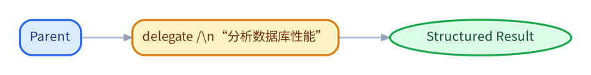

但 `delegate()` 内部其实又有一个完整 Agent Loop：

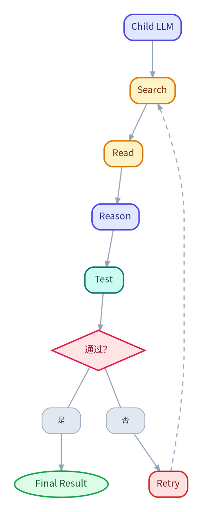

因此一个非常好用的抽象是：

```text
Subagent = 内部拥有自己 Loop 的高级 Tool。
```

Tool Filtering 也因此很重要。DB Child 只需要 `read/search/sql`，就不必拥有 `deploy/delete/send_email` 等无关或高风险能力。这同时改善：

- Tool Selection；
- Context Size；
- Least Privilege；
- Safety。

---

## 7.4 Subagent 不等于自动并行

创建独立 Child Context，并不会自动产生并发。如果父 Agent 是：

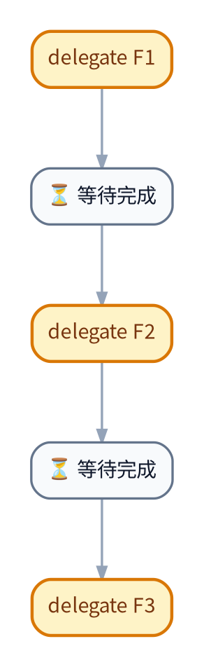

仍然是串行执行。

真正并发需要额外的 Scheduler / Async / Worker Pool / Workflow Engine：

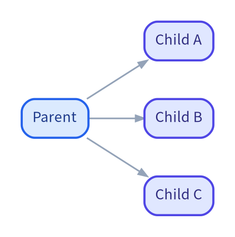

而且只有**相对独立的任务**适合并发。如果依赖关系是：

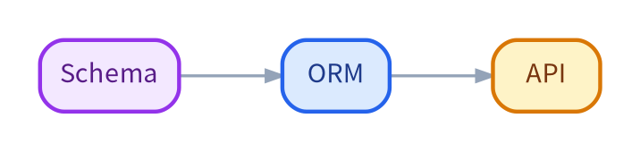

就不能让三个 Child 无脑同时开始。

因此需要把两个概念分开：

```text
Subagent 提供 Context / Execution Boundary；Parallelism 是额外的调度能力。
```

---

## 7.5 父子预算：重点不是背 `50 × 50`

“父 50 步、子 50 步 = 最坏 2500 步”只有在特定结构下成立：Parent 的许多 Iteration 都可能 Spawn 一个最多 50 步的 Child。

更一般的理解是：

```text
Total Work
≈ Parent Work
+ Σ Child Work
```

如果 Parent 创建 `N` 个 Child，每个最多 `C` 步，那么 Child Work 上界接近：

```text
N × C
```

只有当 `N` 又随着 Parent Step 增长时，才表现出类似 `P × C` 的放大。

真正更危险的是嵌套 Agent Tree：

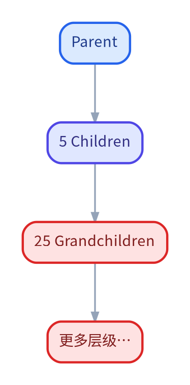

因此生产级预算应该是多维的：

```text
Step Budget
Token Budget
Cost Budget
Time Budget
Output Budget
Concurrency Budget
Max Children
Max Depth
```

Child 通常应该比 Parent 拥有更窄、更小的预算。如果一个很小的 Subtask 经常需要几十上百步，往往意味着任务拆解本身还不够好。

---

## 7.6 Summary Cap 与 Child Failure

Context Isolation 如果最后 Child 把 30K Token 全部返回给 Parent，就失去意义。因此 Parent 应该拿“结构化浓缩结果”，而不是粗暴的全部历史。

也不建议只做简单的 `answer[:2000]` 截断，因为可能把关键失败信息截掉。更好的 Contract 是：

```text
status
summary
findings
evidence
artifacts
verification
risks
```

Child 失败时，Parent 也需要策略：

```text
Retry
换模型
重新拆任务
Parent 接管
标记 blocked
请求 Human
```

所以 `delegate()` 本身也应该被当成一个可能失败的 Tool。

### 本章 Takeaways

1. Subagent 的核心价值之一是 Context Isolation，而不是单纯“多开几个模型”。
2. Parent 应传 Minimum Sufficient Context，而不是复制完整历史。
3. Context Isolation 不等于 Information Isolation；要设计清晰的 Parent/Child Contract。
4. Subagent 可以理解成 Agent-as-a-Tool。
5. Subagent ≠ Parallelism；并发需要额外 Scheduler，并且依赖任务不能无脑并行。
6. 父子预算本质是 Agent Tree 的 Work Amplification，不要机械背固定乘法公式。
7. 预算应同时控制 Steps、Tokens、Cost、Time、Concurrency、Depth、Children 和 Output Size。

---

# 第八章：Generator-Evaluator——把“生成”和“评审”拆成两个角色

## 8.1 为什么要分离 Generation 与 Evaluation

如果同一个 Agent 刚完成一个设计，然后继续在原 Context 里问：

```text
“你觉得刚才的方案好吗？”
```

它很容易沿着刚才已经建立的理由继续论证自己的方案。

Generator-Evaluator 的核心是建立一个 Evaluation Boundary：

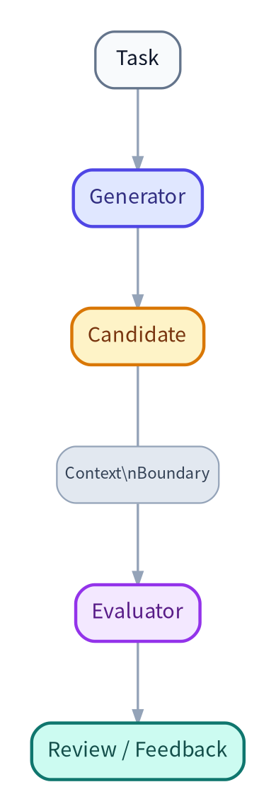

Evaluator 通常只需要：

```text
Original Task
Candidate
Rubric
```

而不是 Generator 的所有 Tool Call、失败路径和内部工作历史。

这样可以减少“Reviewer 被 Generator 之前的推理过程直接锚定”的程度。

但必须精确理解：

```text
Independent Context ≠ Guaranteed Objectivity。
```

Evaluator 仍然是 LLM，也可能判断错误、遗漏问题、受措辞影响；如果 Generator 和 Evaluator 使用同一种模型，还可能共享类似 Model Bias。Context 隔离只是减少一种相关性来源，而不是创造绝对客观裁判。

---

## 8.2 Verification 与 Evaluation 必须分开

这两个机制看起来都在“检查”，但性质不同：

| 机制 | 主要依据 | 适合的问题 |
| --- | --- | --- |
| Verification | 外部可观察 Evidence | 代码能否运行、API 是否返回 200、测试是否通过 |
| Evaluation | LLM 基于 Rubric 的判断 | 设计是否清晰、逻辑是否完整、代码是否易维护 |

因此一个重要原则是：

```text
能用客观工具验证的地方，优先 Tool Verification；LLM Evaluator 用于没有简单确定性标准的质量判断。
```

例如：

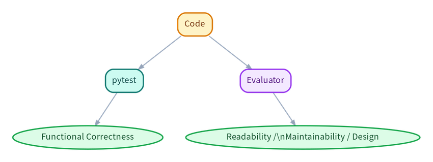

两者组合比让 Evaluator 去猜“代码能不能运行”更合理。

---

## 8.3 Rubric 比“再调一次 LLM”更重要

如果只告诉 Evaluator：

```text
“根据 correctness 打分”
```

这个标准仍然很模糊。

更成熟的 Evaluation 应有明确 Rubric，例如：

```text
Correctness
- 是否满足业务要求？
- 是否有逻辑遗漏？

Maintainability
- 模块职责是否清楚？
- 是否存在重复逻辑？

Security
- 输入是否被验证？
- 是否可能越权？

Performance
- 是否存在明显 N+1 / 重复 IO？
```

因此 Evaluation Quality 更接近：

```text
Evaluator Capability
×
Rubric Quality
×
Input / Evidence Quality
```

而不是“多一次 LLM Call 就自动更可靠”。

---

## 8.4 真正有价值的是 Feedback Loop，不是一个 Score

单次：

```text
Candidate → score 0.62
```

价值有限。

完整模式应该是：

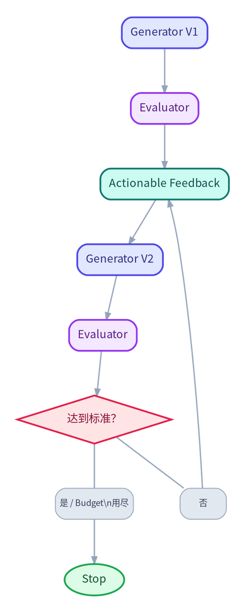

Evaluator 最重要的输出往往不是 `0.62`，而是：

- 哪里有问题；
- 为什么是问题；
- 需要改什么；
- 哪些风险尚未解决。

这里还能看到一个很重要的 Context 设计：Evaluator 不需要继承 Generator 的全部历史，但 Generator 下一轮应该收到**评审结论**。因此：

```text
Context Isolation 不是把所有信息切断，而是 Controlled Information Flow。
```

---

## 8.5 Multiple Candidates 与 Model Routing

从架构上看，Evaluator 也可以理解成一种**特殊职责的 Subagent**：普通 Subagent 的任务是“完成某件工作”，Evaluator 的任务是“按照 Rubric 审查别人的工作”。两者都依赖独立 Context、明确输入和明确输出 Contract。

Generator-Evaluator 还可以扩展为：

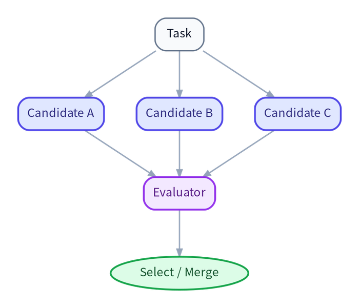

这适合架构方案、Research Hypothesis、复杂写作等没有唯一确定答案的问题，但 Generation Cost 会随着 Candidate 数量增加，因此必须权衡 Quality vs Cost。

课程用 GAN 的“一方生成、一方挑刺”来帮助理解循环，这只是教学类比。这里是 **inference-time orchestration**，并不是 GAN 那种训练阶段的 Generator/Discriminator 对抗训练，不需要为了理解 Agent Evaluator 去学习 GAN。

“Evaluator 可以使用更小模型”是一个可能的成本优化，而不是普遍规律。判断复杂法规实现、分布式 Race Condition 或安全问题，Evaluation 可能比初始生成更难。因此正确原则是：

```text
根据角色难度、风险和成本选择模型，而不是固定 Generator=大模型、Evaluator=小模型。
```

类似 `temperature=0.3` 只是教学参数；应该理解“评审通常追求相对一致性”，而不是背具体数字。

如果 Evaluator 输出解析失败，生产系统也不应该悄悄默认 Candidate 0 获胜。`Evaluation Failure ≠ Candidate 0 Wins`。更安全的策略通常是重试结构化输出，仍失败则显式标记 Evaluation Failed。

### 本章 Takeaways

1. Generator-Evaluator 的核心是 Separation of Generation and Evaluation。
2. 独立 Context 可以减少路径锚定，但不能保证绝对客观。
3. Verification 依赖外部 Evidence；Evaluation 依赖 Rubric + LLM Judgment。
4. 能客观验证时优先 Tool，不要让 Evaluator 猜可执行事实。
5. 真正有价值的是 `Generate → Evaluate → Feedback → Refine → Re-evaluate`。
6. Evaluator 的 Rubric 和 Actionable Feedback 比一个裸分数更重要。
7. Evaluator 不一定应该用小模型，应按任务难度和风险决定。

---

# 第九章：Hooks、Permission 与 Budget——把横向能力变成治理层

课程这一章真正展开的是 Hooks；Permission Gate 和 Token Budget 在整体架构与附录中出现，但没有像前几章那样完整展开代码。这里按照整套 Harness 逻辑把三者放在同一个 Governance 视角下理解。

## 9.1 Hooks：为什么 Agent Core 不应该什么都管

随着系统功能增加，如果所有逻辑都硬编码到 `run_agent()`：

```text
load_memory
check_budget
compress_context
call_llm
count_tokens
check_permission
run_tool
record_progress
save_trace
...
```

Agent Core 会迅速变成一个巨大的高耦合函数。

Hooks 的基本思想是：

```text
Agent Core 只宣布生命周期事件；外围模块自己订阅并执行。
```

例如：

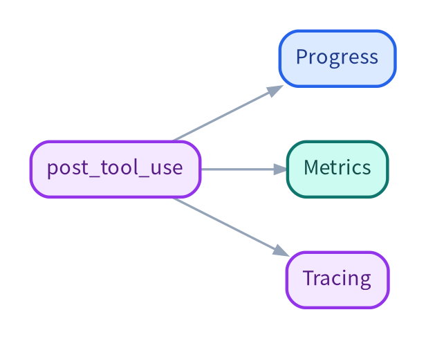

这实际上就是经典的 Observer / Event Bus / Callback / Interceptor 思想在 Agent Harness 中的应用。

因此：

```text
register
→ “我对这个事件感兴趣”

trigger
→ “这个事件现在发生了”
```

Hooks 的真正价值是把 Logging、Progress、Metrics、Security、Budget 等 Cross-cutting Concerns 从核心业务 Loop 中抽出来，实现 Loose Coupling。

---

## 9.2 六个生命周期位置应该理解，而不是死背

Mini Harness 定义：

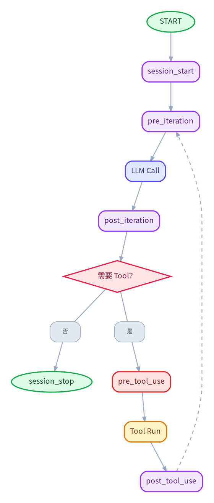

它们分别适合挂载：

- `session_start`：初始化 Progress、Trace、Session State；
- `pre_iteration`：Context 检查、Budget/Deadline/Cancel 预检；
- `post_iteration`：Token、Latency、Usage、Checkpoint；
- `pre_tool_use`：Permission / Security Gate；
- `post_tool_use`：Progress、Tool Metrics、Trace；
- `session_stop`：Final Report、Usage Summary、Session Cleanup。

但“六大标准事件”只是 Mini Harness 自己的 Lifecycle Taxonomy，不是 Agent 行业规定所有框架都必须使用这六个名字。别的框架可能叫：

```text
before_model / after_model
before_tool / after_tool
on_start / on_end
pre_run / post_run
```

看到不同名称时，应该先问三个问题：

1. 它挂在生命周期哪个位置？
2. 它能看到/修改哪些数据？
3. 它只能观察，还是能阻断执行？

---

## 9.3 Observation Point 与 Enforcement Point

普通 Hook：

```text
事情发生
 ↓
通知 Handler
```

主要是 Observation / Side Effect。

`pre_tool_use` 这种 Gate 不一样：

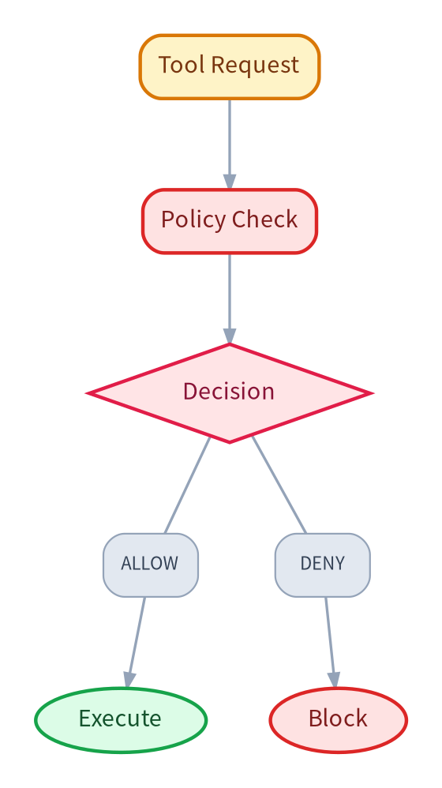

它是 Control / Enforcement Point，可以在危险动作真正执行前 Veto。

这也解释了为什么 Permission 必须发生在 Tool **之前**。如果把安全检查放在 `post_tool_use`：

```text
危险命令已经执行
 ↓
系统才说“这个很危险”
```

已经没有意义。

---

## 9.4 Permission Gate：模型的意图不能直接等同于执行权限

Agent 的 Tool Call 本质是一个**请求**，不是天然授权：

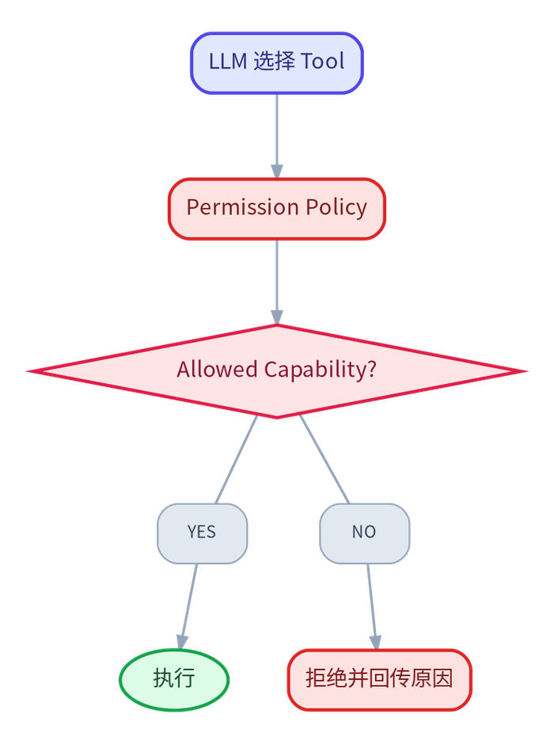

教学实现可以用危险命令黑名单演示，但生产环境通常需要更强的 Capability / Policy 设计，例如：

- Tool Allowlist / Least Privilege；
- Path / Resource Scope；
- Read vs Write vs Delete 权限区分；
- Sandbox；
- Human Approval；
- Tenant / User 权限继承；
- Audit Log。

这里和 Subagent Tool Filtering 也是同一个安全思想：

```text
只给一个 Agent 完成当前任务真正需要的能力。
```

Gate Handler 如果自己异常，安全相关场景通常应该 **Fail Closed**：

```text
权限系统无法判断
 ↓
默认 DENY
```

而不是：

```text
权限系统坏了
 ↓
那就先执行吧
```

---

## 9.5 普通 Hook 出错是否一定可以忽略？

Mini Harness 的普通事件采取“Handler 出错但主流程继续”的 Best-effort 策略，适合 Logging、Metrics 等辅助功能。

但生产系统不能简单变成：

```text
Gate = critical
其他 Hook = 都不重要
```

例如：

```text
Checkpoint Writer
 ↓
持久化失败
```

如果业务要求 Durable Execution，这可能就是 Critical Failure。

所以更准确的设计应该考虑 Hook Criticality：

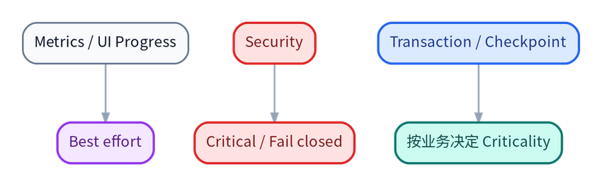

Handler 的顺序、Timeout、Async 执行同样是生产问题。Mini Harness 顺序同步执行所有 Handler，如果一个 Remote Trace Hook 很慢，就可能直接拖慢每次 Tool Call。成熟系统会考虑 Priority、Always-run Handler、Async/Buffer/Batch 等策略。

---

## 9.6 Token Budget：给 Agent 一个 Resource Envelope

`max_steps` 只能限制“最多几轮”，但真实 Agent 成本不仅由步数决定：

```text
同样 10 步
可能每步 1K token
也可能每步 50K token
```

因此 Budget 更接近：

```text
Agent 可以在多大的资源包络内运行？
```

常见维度包括：

```text
Steps
Tokens
USD Cost
Wall-clock Time
Tool Calls
Subagent Count
Concurrency
Depth
Output Size
```

Budget 应该在执行过程中不断累计和检查，而不是只在 Session 结束以后做报表。达到阈值后，应优雅停止、保存已有状态、返回清楚的“预算耗尽”原因，而不是继续烧资源。

Subagents 会放大预算问题，因此父子预算必须分别限制，不能只给整个 Parent 一个 `max_steps` 就认为安全。

---

## 9.7 Hooks 与 Middleware：相似，但不要机械画等号

Hook 更像：

```text
Lifecycle Event
 ↓
Registered Handler
```

Middleware 常见形态更像：

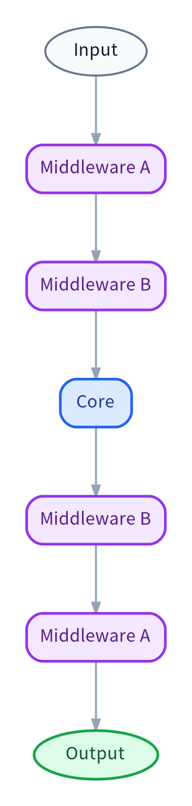

Middleware 通常更强调包裹、修改输入输出、短路；Hook 更强调事件与扩展点。但现代 Agent Framework 经常混合两者能力，所以名字并不重要。

最重要的问题仍然是：

```text
它插在哪里？能看到什么？能修改什么？能不能阻断？
```

### 本章 Takeaways

1. Hooks 的价值是给 Agent Lifecycle 提供 Extension Points，而不是实现某个业务功能。
2. `register` 是订阅；`trigger` 是事件发生。
3. Hooks 把 Progress、Metrics、Permission、Budget 等 Cross-cutting Concerns 从 Agent Core 中解耦。
4. 普通 Hook 更偏 Observability；Gate 是 Enforcement Point，可以 Veto。
5. Security Gate 应倾向 Fail Closed，但普通 Hook 是否可忽略要按 Criticality 决定。
6. “六个标准事件”是 Mini Harness 设计，不是行业官方标准。
7. Permission 的本质是 Capability Policy；LLM Tool Call 只是请求，不等于授权。
8. Budget 的本质是 Resource Envelope，应覆盖 Step、Token、Cost、Time、Concurrency、Depth 等维度。

---

# 第十章：E2E——如何正确理解 Baseline vs Full Harness

## 10.1 实验数字告诉了我们什么

课程的一次真实 E2E 运行里，Baseline 与 Full Harness 的结果大致是：

| 指标 | Baseline | Full Harness |
| --- | ---: | ---: |
| Steps | 1 | 7 |
| Time | 35.45s | 94.02s |
| Tokens | 1,104 | 15,053 |

也就是大约：

```text
13.6× Tokens
2.65× Latency
```

这组数字最值得说明的是：

```text
Orchestration 有成本。
```

但是绝对不能把它记成：

```text
“Harness 固定需要 13.6 倍 Token。”
```

实际倍率取决于任务复杂度、模型、迭代轮数、Tool Result 大小、Verification、Context、Subagent 等。另一个任务可能是 2×、5×、20×，也可能 Baseline 根本做不完，此时倍率比较没有意义。

---

## 10.2 这不是严格 apples-to-apples Benchmark

Baseline 是一次调用；Full Harness 做了 Planning、Tools、Verification、Progress、Budget 等更多工作。

因此比较：

```text
1,104 tokens
vs
15,053 tokens
```

并不能证明：

```text
“在完成完全相同工作且质量相同的前提下，Harness 贵 13.6 倍。”
```

它更适合证明：

```text
为了获得更多执行与治理能力，系统引入了明显 Orchestration Overhead。
```

所以这组 E2E 数据应该帮助建立 Cost Intuition，而不是当作性能定律。

---

## 10.3 Harness 真正买来的三类工程属性

### Observability：发生了什么？

```text
Final Answer
+
Tool Trace
+
Errors
+
Progress
+
Usage
+
Latency
```

当 Agent 出问题时，可以定位“哪一步、什么 Tool、什么结果、花了多少资源”。`progress.md` 只是最小示范；生产 Observability 往往还需要 Trace、Span、Structured Log、Metrics、Correlation ID 等。

### Intervenability：能不能在执行前介入？

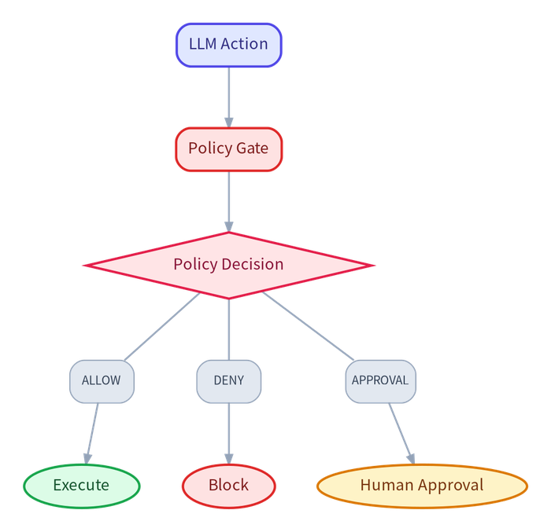

Permission 是典型例子。

### Controllability：会不会无限运行？

```text
max_steps
Token Budget
Cost Budget
Timeout
Subagent Limit
```

共同定义 Agent 的 Resource Envelope。

因此 Harness 主要买来的不是“答案字符多 13%”，而是：

```text
执行过程更可观察、可干预、可控制。
```

---

## 10.4 Mini Harness 与成熟 Agent 产品：看 Problem Space，不要机械一一对应

课程把 Mini Harness 的机制与成熟 Coding Agent/Agent Product 做映射，这个表真正想传达的是：

```text
成熟 Agent 都必须面对相似的问题。
```

例如不管产品内部实现如何：

```text
Loop 怎么跑？
Context 怎么控制？
Tool 怎么调？
状态怎么保存？
结果怎么验证？
危险行为怎么阻止？
成本怎么限制？
```

这就是 Mini Harness 的学习价值：结构透明，便于看到这些 Problem Space。

不要把具体产品实现细节、事件数量、某个文件名当成长期知识，因为这些会随版本变化。

---

## 10.5 “Harness 与模型完全解耦”也要更精确理解

好的设计应该把 Provider-specific 细节隔离：

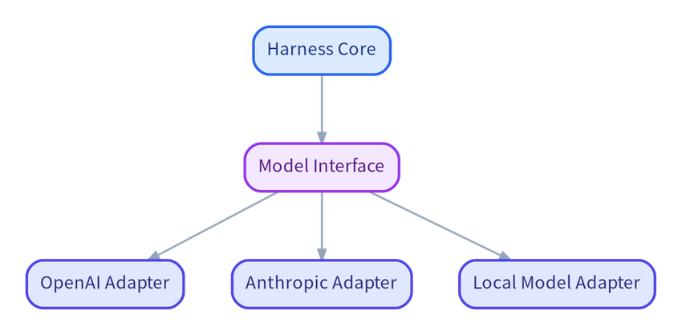

这样 Context、Progress、Permission、Budget 等上层概念可以复用。

但不同 Provider 在 Tool Calling、Streaming、Usage Metadata、Reasoning、Context Limit、Prompt Cache、Parallel Tool Calls、Structured Output 等方面可能存在差异。因此不能保证“换 SDK 永远只改固定五处、其他一行都不用动”。

正确原则是：

```text
尽量把 Provider-specific details 留在 Adapter Boundary 后面，而不是假设 Provider 完全等价。
```

---

## 10.6 Harness 会 go stale：机制必须由 Failure Mode 驱动

每个 Harness Component 都隐含一个假设：

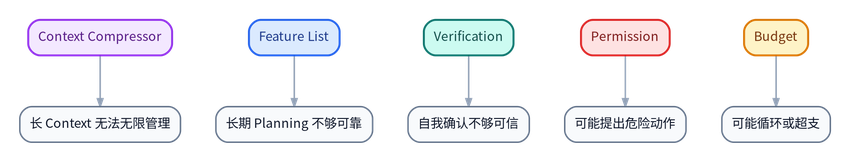

如果模型、工具、平台能力变化，这些假设也可能变化。

因此：

```text
Harness 是工具，不是信仰。
```

不要为了“Production-grade”把 11 个机制全部装进每一个项目。更好的方法是：

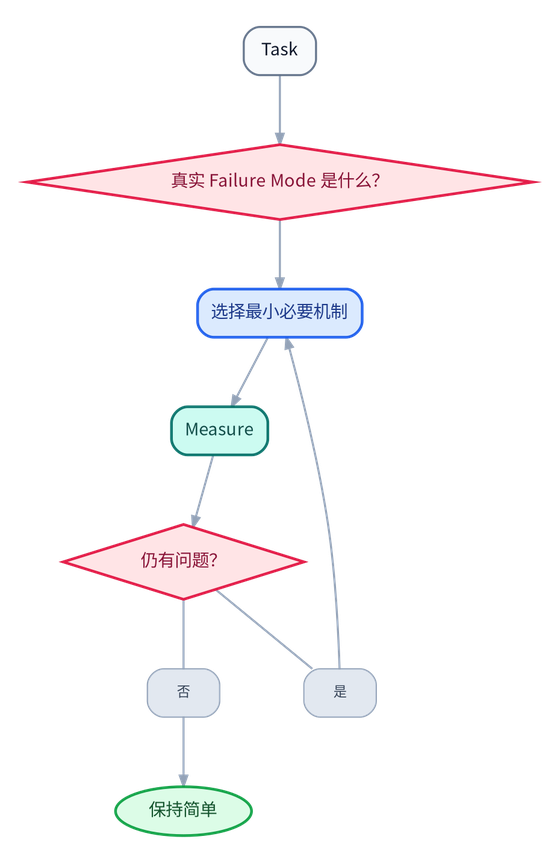

这叫 Problem-driven / Failure-driven Engineering。

简单问答也许只需要：

```text
LLM
```

一个 RAG App 可能只需要：

```text
LLM + Retrieval + Tool
```

修改大型代码库的长任务才可能逐步需要：

```text
Planning
Context Management
Subagents
Verification
Permission
Budget
Tracing
```

所以 Harness 应该被理解成一个 Spectrum，而不是 Baseline 与 Full Harness 两档开关。

### 本章 Takeaways

1. 13.6× Tokens、2.65× Time 是一次具体实验，不是 Harness 固定倍率。
2. Baseline 与 Full Harness 做的工作量不同，因此不是严格 apples-to-apples benchmark。
3. Harness 主要购买的是 Observability、Intervenability、Controllability。
4. Mini Harness 与成熟 Agent 产品的价值在于共享 Problem Space，不是具体实现一一等价。
5. Provider Adapter 可以降低耦合，但不能假设所有 SDK 完全等价。
6. Harness Component 应由 Failure Mode 驱动，而不是 Checklist 驱动。
7. Over-engineering 同样是 Agent Engineering 的风险。

---

# 第十一章：把 11 个机制收束成一套真正可复用的思维框架

学完以后，最不应该留下的是：

```text
我记得有 11 个 Python 文件
```

真正应该留下的是：**面对一个 Agent 系统，我知道该问什么问题。**

## 11.1 第一层：Execution——Agent 怎么行动？

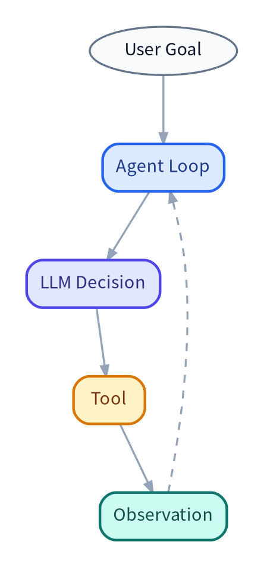

核心机制：Agent Loop + Tool Use。

关注：

- 怎么判断继续还是结束；
- Tool Schema 是否清楚；
- Tool Error 是否结构化回传；
- 有没有基本循环上限。

---

## 11.2 第二层：Context & State——Agent 当前应该知道什么？

```text
Context Management
→ 当前给模型看什么？

Progress
→ 过去发生了什么？

Feature State
→ 现在做到哪、下一步是什么？

Checkpoint / Artifacts
→ 崩溃后还能恢复什么？
```

核心目标：

```text
不要把所有历史、所有任务状态、所有成果都混在 messages 里。
```

---

## 11.3 第三层：Quality——怎么证明它做对了？

```text
Objective Evidence
→ Verification

Complex / Subjective Quality
→ Evaluator + Rubric
```

优先顺序通常是：

```text
能用真实工具验证
→ 先 Tool Verification

没有简单客观标准
→ 再使用 LLM Evaluation
```

Feature 的 Completed 状态最好由 Acceptance Criteria 驱动。

---

## 11.4 第四层：Orchestration——复杂任务由谁做？

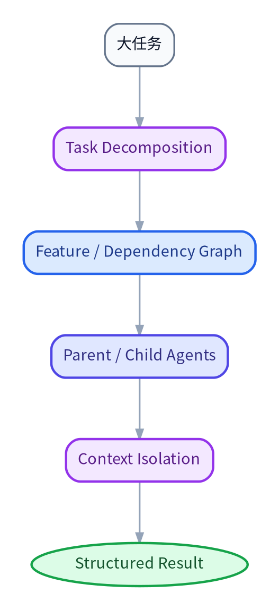

关注：

- 子任务是否真正独立；
- Child 是否只看到必要 Context；
- 是否真的需要并行；
- Parent/Child Contract 是否清楚；
- Agent Tree Budget 是否受控。

---

## 11.5 第五层：Governance——系统如何保持安全、可控、可观察？

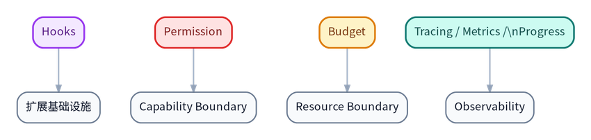

治理层解决的不是“模型会不会回答”，而是：

```text
这个系统能不能放心地在真实环境里长期运行。
```

---

## 11.6 一次完整任务应该怎样流动

假设用户要求：

```text
修复项目的登录 Bug，并确保没有破坏现有功能。
```

可以把整套 Harness 串成：

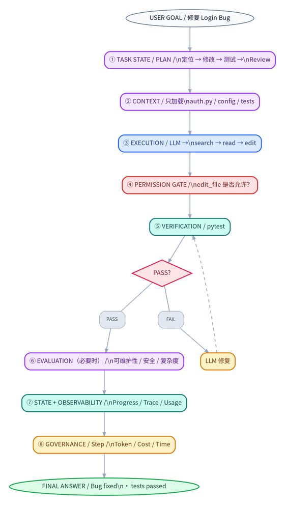

这条链比任何一个具体框架 API 更值得记忆。

---

## 11.7 最终判断标准：不要问“用了多少 Agent 技术”，要问“解决了什么 Failure Mode”

一个好的 Agent 设计不一定复杂。

错误思路：

```text
Production Agent
= Memory + RAG + Planner + Subagents + Evaluator + 20 Tools + ...
```

正确思路：

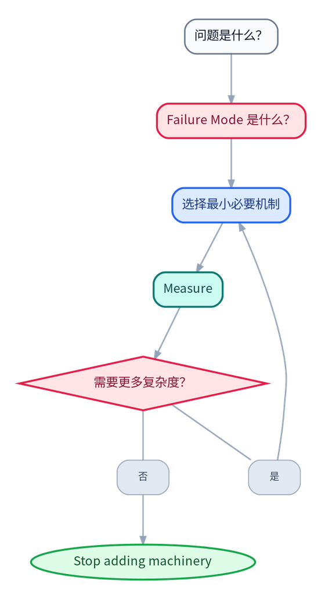

这也是整套 Harness Engineering 最有价值的工程习惯：

```text
Mechanism should be problem-driven, not checklist-driven.
```

### 本章 Takeaways

1. Production Agent Engineering 的核心不是让模型“多想几步”，而是建立清楚的 Execution、Context、State、Quality、Orchestration、Governance 边界。
2. Model 提供通用推理能力；Harness 决定这些能力如何被组织、执行、验证和限制。
3. 能存成 State 的事实不要让模型重复推理；能用 Tool 验证的事实不要让模型自我确认。
4. Context 的目标是 Minimum Sufficient Context；Subagent 的目标是局部复杂度隔离。
5. Verification 与 Evaluation 是两类不同质量机制。
6. Hooks、Permission、Budget 把 Agent 从“能跑”升级到“更可治理”。
7. Harness 有成本，因此必须按 Failure Mode 按需增加，而不是组件越多越高级。
8. 最终应该能脱离任何具体框架，用同一套问题分析 LangGraph、Coding Agent、Research Agent 或自研 Harness。

---

# 附录 A：最容易混淆的概念对照

## A.1 Progress vs Artifact vs Checkpoint vs Resume

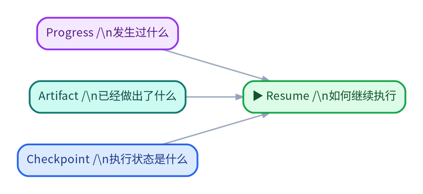

---

## A.2 Context Compression vs Feature List vs Subagent

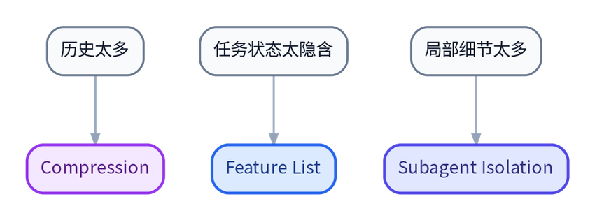

三者可以同时存在，不能互相替代。

---

## A.3 Structured Error vs Verification

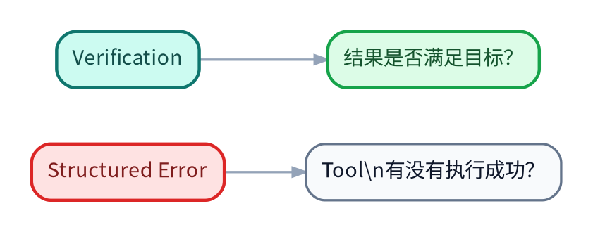

---

## A.4 Verification vs Evaluation

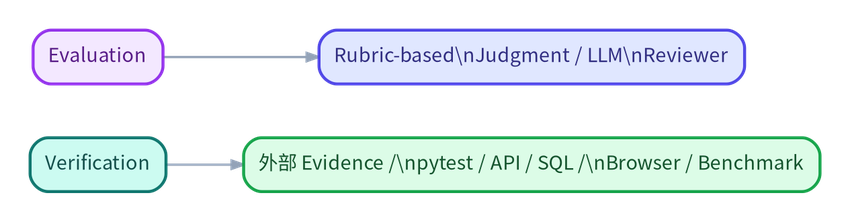

---

## A.5 Log vs State

```text
Log
→ 历史事件不断追加

State
→ 当前任务快照不断更新
```

Progress 更像 Log；Feature List 更像 State。

---

## A.6 Hook vs Gate

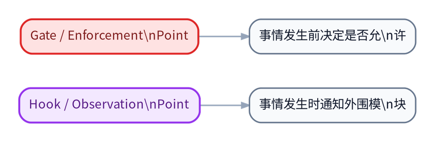

---

## A.7 Subagent vs Parallelism

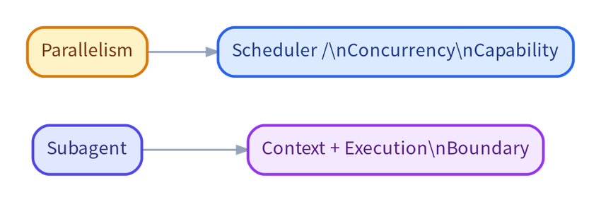

有 Subagent 不代表自动并行。

---

# 附录 B：复习时只记这 11 个机制的一句话

| 机制 | 一句话记忆 |
| --- | --- |
| Agent Loop | 让模型可以基于 Observation 持续决策，而不是只回答一次 |
| Tool Use | 用 Schema 描述能力，由 Harness 执行真实操作并回传结果 |
| Progress | 把“发生过什么”持久化，提供 Trace 与 Recovery 线索 |
| Context Management | 控制模型真正需要看到的信息，避免 Overflow 与 Rot |
| Feature List | 把 Task State 从自然语言历史中外置为结构化状态 |
| Verification | 用外部 Evidence 决定结果是否真的满足目标 |
| Subagents | 给复杂子任务独立 Context/Execution Boundary |
| Generator-Evaluator | 把生成与评审分离，并通过 Feedback Loop 改进结果 |
| Permission | Tool Call 只是请求，Policy 决定是否真正允许执行 |
| Hooks | 给 Agent Lifecycle 提供可插拔的 Extension Points |
| Budget | 给 Agent 定义 Steps/Tokens/Cost/Time 等 Resource Envelope |

---

# 最终八句话

1. **Agent Loop + Tool Use 是执行引擎。**
2. **Context Engineering 的目标不是塞最多信息，而是提供 Minimum Sufficient Context。**
3. **Progress、Artifact、Checkpoint、Resume 是四个不同层次，不能混为一谈。**
4. **Feature List 把 Task State 外置；Subagent 把局部复杂度隔离。**
5. **能用真实工具验证，就不要依赖 LLM 自我确认；没有客观标准时再使用 Evaluator。**
6. **Hooks 提供扩展基础设施；Permission 和 Budget 划定安全与资源边界。**
7. **Harness 不是组件越多越高级，而应根据 Failure Mode 按需增加。**
8. **Production Agent Engineering 的核心，是围绕模型建立清晰的 Execution、Context、State、Quality、Orchestration 与 Governance 边界。**
