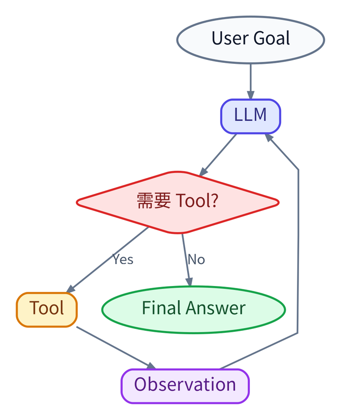
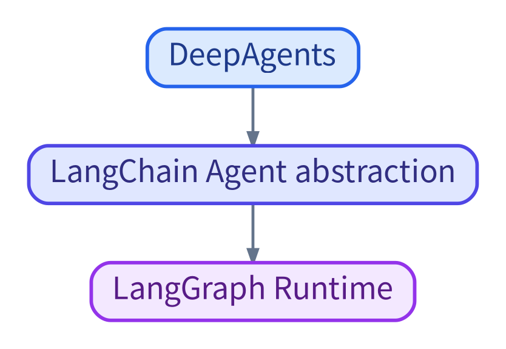
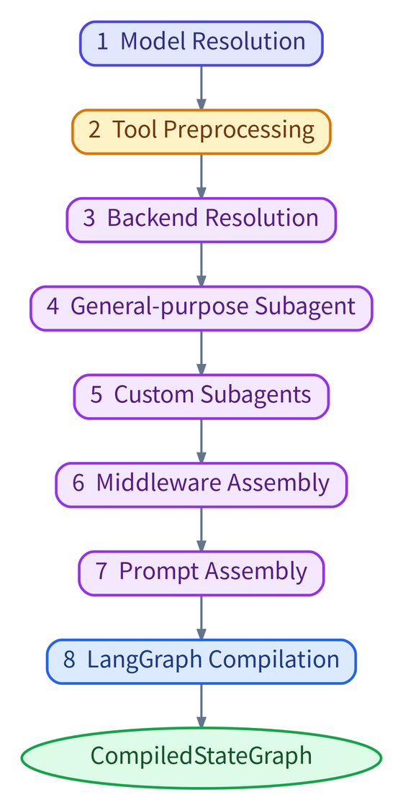
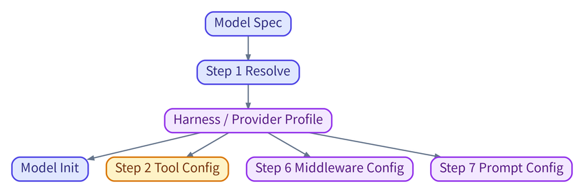
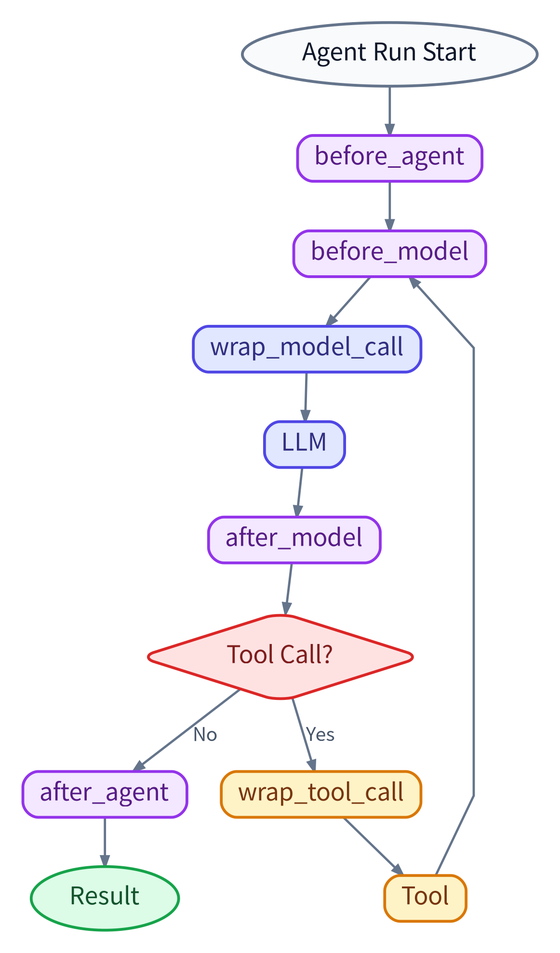
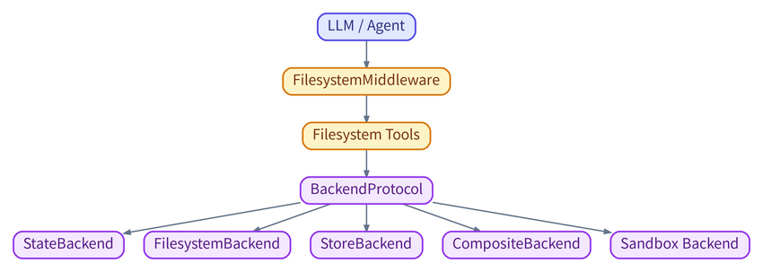
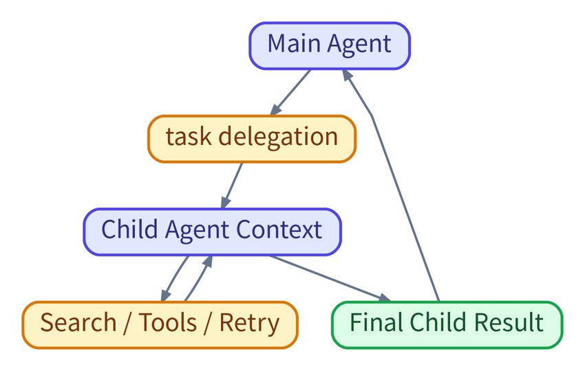
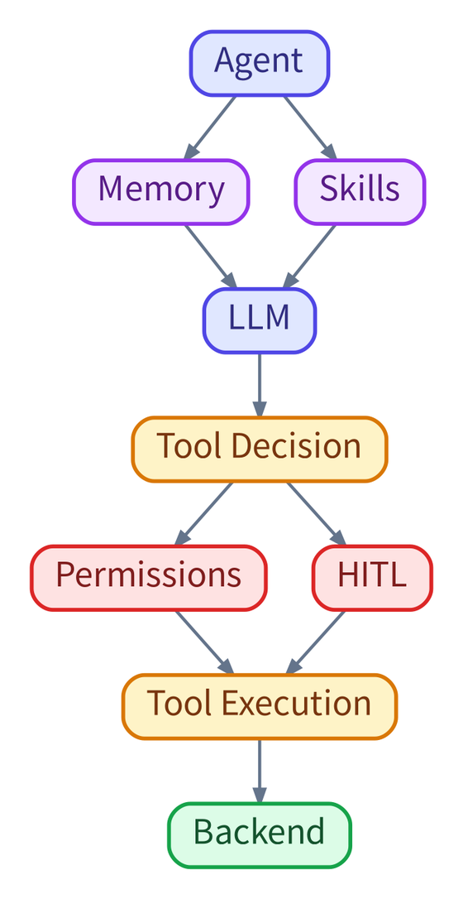
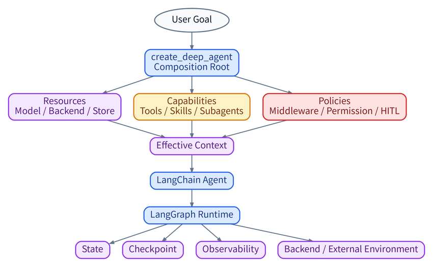

# Harness Engineering · DeepAgents 框架实战深度读书笔记

> 这份笔记以课程第三节 **DeepAgents 框架实战** 为主材料，并吸收我们在逐章学习过程中已经确认过的解释、纠错与工程化补充。它不是把历史回答拼接在一起，也不是逐行抄课件代码，而是重新组织成一条可以独立阅读的工程逻辑：**为什么需要 Harness → DeepAgents 如何组装 → Middleware 如何介入运行时 → Backend 如何隔离环境与存储 → Subagent 如何隔离 Context → HITL / Skills / Memory / Permissions 如何组成治理层 → 最后怎样把这些机制组合成生产级 Agent。**

> **版本边界**：课件主要基于 `deepagents==0.5.3`。本文把“长期可迁移的 Harness / Agent 原理”和“DeepAgents 0.5.3 的具体实现”分开写；后续版本变化只作为单独的版本补充，不把版本细节混成核心结论。

> **MarkText 宽屏静态图版**：所有流程图均已预渲染为静态 PNG，不依赖 MarkText 内置 Mermaid，因此不会再因 Mermaid 版本差异出现节点重叠、空白或文字错位。图片继续沿用上一份笔记的宽屏比例规则：竖向图最大宽度约 560 px、近方形约 700 px、横向图约 850 px；核心结论、条件判断、状态说明和执行链短段仍使用独立 `text` 代码块，保持统一灰底、等宽字体和块级视觉风格。

---

## 先建立全局认知：DeepAgents 到底在解决什么

最简单的 Tool Agent 可以写成：



这个 Loop 能跑，但一旦任务变长，就会马上出现新的工程问题：Context 不断膨胀、Tool Result 污染、模型忘记任务做到哪里、复杂工作塞满主 Context、高风险工具可能被误调用、中断后无法恢复、不同模型对 Prompt/Tool 的最佳配置不同、文件到底放内存还是磁盘也开始影响行为。

因此真正的 Agent 需要的不只是一个 Loop，而是一套围绕 Loop 的 **Harness**：

```text
Harness
=
Execution + Context + State + Capability + Orchestration + Governance + Observability
```

DeepAgents 的定位，可以先记成：

```text
DeepAgents
=
一个 opinionated、batteries-included 的 Agent Harness
```

它不是替代 LangChain / LangGraph，而是站在它们上面，把常见的 Harness 机制按一套默认策略装配起来：



整套课程最终可以压缩成五个工程问题：

| 工程问题 | 主要机制 |
| --- | --- |
| Agent 能做什么？ | Tools、Skills、Subagents |
| Agent 运行时在哪里被控制？ | Middleware / Hooks |
| State、文件和长期数据放哪里？ | Backend、Store、Checkpointer |
| 复杂任务由谁做、怎么隔离？ | SubAgent、CompiledSubAgent、AsyncSubAgent |
| 哪些动作可以自动做、需要人批、或绝对禁止？ | Permissions、HITL、Sandbox |

### 全局 Takeaways

1. DeepAgents 不是另一个大模型，而是围绕 LLM/Agent Loop 构建执行与治理基础设施。
2. 学习重点不是背 DeepAgents 类名，而是掌握 `Failure Mode → Mechanism → Framework Implementation`。
3. `create_deep_agent()` 最重要的理解不是“创建 Agent 的 helper”，而是 **Harness 的 Composition Root**。
4. DeepAgents 的具体默认 Middleware、Prompt 和 API 会变化；Context、State、Tool Boundary、Delegation、Permission、Checkpoint 等机制不会因为版本升级而消失。

---

# 第 0 章：环境准备与全局配置——先保证运行边界清晰

第 0 章技术难度不高，但它在工程上很重要：Harness 的行为依赖解释器、当前工作目录、环境变量、模型配置、Tracing 和 Runtime 服务。如果这些基础环境不稳定，后面所有“Agent 行为异常”都可能只是环境问题。

## 0.1 Python 解释器与当前目录

`sys.executable` 回答：

```text
当前 Notebook / Python 进程
到底是哪个解释器在运行？
```

`Path.cwd()` 回答：

```text
相对路径、.env、skills、memory、langgraph 配置
会从哪个目录开始解析？
```

所以环境检查不是形式主义，而是为了避免：

```text
代码看起来一样
↓
解释器 / cwd 不一样
↓
依赖、.env、Skill 路径、Memory 路径全不一样
```

## 0.2 依赖锁定

课件固定 `deepagents==0.5.3` 的核心价值不是这个版本号本身，而是：

```text
可复现性 > “永远装最新”
```

框架行为、默认 Middleware、Prompt、Backend API 都可能随版本改变，因此教学和生产都应该明确版本边界。

## 0.3 `.env` 与模型字符串

课件把 DeepSeek 官方模型名和 LangChain / DeepAgents 的 provider-prefixed model spec 分开：

```text
DeepSeek API model name
= deepseek-chat

DeepAgents / LangChain model spec
= deepseek:deepseek-chat
```

这里的重点不是 DeepSeek，而是 **Model Resolution 应该集中管理**，不要在不同模块里到处硬编码 Provider / Model。

## 0.4 LangSmith 与 `langgraph dev`

这两个容易混：

```text
LangSmith
= Observability / Tracing

langgraph dev
= Serving / Runtime access
```

前者回答：

```text
Agent 刚才到底做了什么？
```

后者回答：

```text
这个 Graph 如何作为一个可调用 Runtime 跑起来？
```

可以粗略类比：

```text
langgraph dev
≈ FastAPI/Uvicorn 的运行入口

LangSmith
≈ Trace / Observability 平台
```

### 本章 Takeaways

1. Harness 调试首先要排除解释器、cwd、依赖和配置漂移。
2. 模型配置应集中管理；Provider 适配不应散落在业务代码里。
3. Runtime 与 Observability 是两套能力：一个负责“跑”，一个负责“看清楚怎么跑的”。

---

# 第 1 章：为什么需要框架——从“能跑”到“可持续工程化”

前两节课已经完成两步：第一节理解 Harness 的 Failure Modes 与机制，第二节亲手做 Mini Harness。第三节的问题不是“还能不能手搓”，而是：

```text
当机制越来越多时，
是否还应该每个项目都重新实现？
```

## 1.1 手搓 Harness 的三个天花板

课件把痛点归纳为三个方向：

- 重复造轮子：Context、Permission、HITL、Memory、Subagent、Backend 等机制每个项目都要重新写；
- 生产化成本高：单个 demo 能跑，不代表断点恢复、权限、错误处理、存储、Tracing 都已经可靠；
- 多模型适配麻烦：不同 Provider / Model 对 Tool、Prompt、Middleware 可能有不同最佳实践。

真正的问题不是代码行数，而是：

```text
横切能力越来越多
↓
所有项目都各自实现
↓
行为不一致 + 难维护 + 难验证
```

## 1.2 DeepAgents 的定位

DeepAgents 可以理解成：

```text
Raw LLM API
   ↓
Custom Agent Loop
   ↓
LangChain Agent
   ↓
DeepAgents Harness
   ↓
Custom LangGraph（需要完全自定义 Runtime 时）
```

这里不是“越往下越高级”。不同层级是控制权与便利性的取舍。

DeepAgents 的价值在于给出一套 opinionated default：

```text
你不必从零实现所有 Harness 能力，
但仍然可以替换 / 扩展关键组件。
```

## 1.3 三个设计哲学

### 1. Trust the LLM，但不要把安全边界交给 LLM

模型可以负责决策：

```text
“下一步应该调用什么 Tool？”
```

但不应该自己决定：

```text
“我有没有权限读取 secret？”
```

前者可以是 LLM judgement；后者必须由 Harness Runtime 强制执行。

### 2. Progressive customization

先从默认能力开始，再根据真实 Failure Mode 增加复杂度：

```text
Default Harness
↓
发现具体问题
↓
增加 Middleware / Backend / Policy
↓
Evaluation
↓
证明收益后保留
```

### 3. LangGraph-native Runtime

DeepAgents 不重新发明完整 Runtime；组装完成后交给 LangGraph 执行。因此要区分：

```text
Harness
= 能力与策略怎么组装

Runtime
= 这些节点和状态怎么真正运行、暂停、恢复、流式输出
```

### 本章 Takeaways

1. Mini Harness 教你机制；DeepAgents 教你如何把机制标准化、组合化、生产化。
2. Framework 的价值不是让模型更聪明，而是减少重复工程、统一边界和提高可观察性。
3. 最重要的原则是：**模型负责智能决策，Harness 负责能力边界与执行治理。**

---

# 第 2 章：`create_deep_agent()` 八步组装流水线——Composition Root

这一章是整份课件的结构核心。

先建立最重要的认识：

```text
create_deep_agent()
=
Assembly / Composition Stage

它不是 Agent Runtime Loop
```

它把模型、Tool、Backend、Subagent、Middleware、Prompt 等组件组装好，最后交给 LangChain / LangGraph 变成可以执行的 `CompiledStateGraph`。

## 2.1 全局结构：八步不是八个孤立 API



可以进一步压成：

```text
Step 1–3
= 准备资源 / Normalize dependencies

Step 4–7
= 组装 Harness capability + policy + context

Step 8
= 交给 Runtime
```

## 2.2 参数签名：不要背 15+ 参数，按功能域看

主要可以分成五组：

| 功能域 | 典型参数 | 解决的问题 |
| --- | --- | --- |
| 模型与工具 | `model`, `tools` | Agent 用什么模型、拥有什么外部动作 |
| Harness 能力 | `middleware`, `subagents`, `skills` | 执行骨架与扩展能力 |
| 存储与记忆 | `backend`, `memory`, `store` | 文件、长期信息放哪里 |
| 治理与恢复 | `permissions`, `interrupt_on`, `checkpointer` | 权限、审批、恢复 |
| 调试与元信息 | `debug`, `name`, `cache` | 运行辅助与可观察性 |

真正要形成的感觉是：

```text
看到一个参数
→ 能判断它属于资源、能力、治理、Context 还是 Runtime
```

## 2.3 Step 1：Model Resolution + Harness Profile

模型可以通过 provider:model 字符串传入，也可以传预初始化的 LangChain model instance。

```text
String
→ convenience / framework resolve

Model instance
→ 更显式的 client-level control
```

但 Step 1 不只是“拿到模型对象”，还会涉及 **model-specific profile**。

### Harness Profile 不只是 Step 2 的 Tool 适配

这是我们学习过程中专门纠正过的一点。

错误理解：

```text
Harness Profile
= 只给 Step 2 改 Tool Description
```

更准确的模型是：



在课件 0.5.3 的私有 `_HarnessProfile` 骨架里，可以把字段分成两类：

```text
A. Model Client differences
- init_kwargs
- pre_init
- init_kwargs_factory

B. Harness behavior differences
- tool_description_overrides
- extra_middleware
- excluded_tools
- base_system_prompt
- system_prompt_suffix
```

长期可迁移的设计思想是：

```text
Model capability differences
↓
集中到 Profile / Adapter
↓
不要散落成满项目的 provider if/else
```

课件 0.5.3 的 Profile 查找可以理解成逐级回退：

```text
优先匹配完整 provider:model
↓ 没有
匹配 provider 级配置
↓ 仍没有
使用空 / 默认 Profile
```

这意味着 Model-specific 配置是一个集中式 Adapter 层，而不是要求每个调用点都知道 Provider 差异。

> **版本补充**：课件 0.5.3 的 Harness Profile 主要还是骨架；后续 0.5.4 把 `HarnessProfile` / `HarnessProfileConfig` 等机制公开并强化，把 system prompt、Tool inclusion/naming、middleware、subagent、skills 等 model-specific 差异正式纳入声明式 profile。

## 2.4 Step 2：Tool Preprocessing

Step 2 的核心不是“执行 Tool”，而是：

```text
Assembly-time adaptation of Tool definitions
```

例如同一个 Tool：

```text
search_files
```

不同模型可能对 Tool Description 的写法敏感程度不同，于是 Profile 可以覆盖：

```text
Tool name / Tool description / visibility
```

要记住：

```text
Tool Description
=
给 LLM 看的 API documentation
```

所以 Tool 定义本身就是 Context Engineering 的一部分。

## 2.5 Step 3：Backend Resolution

默认课件版本使用 `StateBackend()`。Backend 的职责不是“Agent Loop 状态”，而是：

```text
Agent-facing virtual filesystem / artifact environment
```

必须和 Checkpointer 分开：

```text
Backend
→ Agent 做出了什么东西？文件在哪里？

Checkpointer
→ Agent 做到哪里了？Graph State 怎么恢复？
```

这一区别会在第 4 章深入。

## 2.6 Step 4：General-purpose Subagent

DeepAgents 0.5.3 会自动给主 Agent 配一个通用子代理，使主 Agent 可以把长任务外包出去。

它最重要的意义不是“多一个 Agent”，而是：

```text
Context Quarantine
```

子代理内部可以产生大量搜索、Tool Result 和中间推理，而主 Agent 只拿最终结果。

同时要注意：

```text
Subagent
≠ Parent Clone
```

Child 应该拥有完成任务所需的最小能力，而不是机械复制 Parent 的所有能力。

## 2.7 Step 5：Custom Subagents

课件有三种主要模式：

```text
SubAgent
→ 自主 Child Agent

CompiledSubAgent
→ 预先写好的 Runnable / Graph 作为 Child Capability

AsyncSubAgent
→ 后台任务 / 调度 / 并发
```

这个分类在第 5 章展开。

## 2.8 Step 6：Middleware Assembly

这是 `create_deep_agent()` 最关键的一步。

课件 0.5.3 的组装逻辑可以抽象成：

```text
Final Middleware Stack
=
Framework Defaults
+ Conditional Framework Middleware
+ User Middleware
+ Model Profile Middleware
+ Governance Middleware
```

更具体地说：

```text
Base Stack
↓
User Middleware
↓
Tail / Governance Stack
```

### 0.5.3 中哪些是默认，哪些是条件式？

| Middleware / 能力 | 0.5.3 行为 |
| --- | --- |
| TodoListMiddleware | 无条件默认 |
| FilesystemMiddleware | 无条件默认 |
| SubAgentMiddleware | 无条件默认 |
| SummarizationMiddleware | 无条件默认 |
| PatchToolCallsMiddleware | 无条件默认 |
| SkillsMiddleware | `skills != None` 才加 |
| AsyncSubAgentMiddleware | 配了 AsyncSubAgent 才加 |
| User Middleware | 用户传入才有 |
| Profile extra middleware | Profile 有配置才加 |
| Tool exclusion | `excluded_tools` 非空才加 |
| PromptCaching | 0.5.3 会装入；不适用 Provider 时跳过 |
| MemoryMiddleware | `memory != None` |
| HITL | `interrupt_on != None` |
| PermissionMiddleware | `permissions` 非空 |

这张表只用于理解 0.5.3 的组装方式，不应背成 DeepAgents 永久默认。

> **版本补充**：DeepAgents 0.7.0 把 Todo 改为 opt-in。官方给出的理由是 eval 发现默认 Todo 带来额外 token / latency / cost，但没有稳定提升任务性能。这个变化正好说明：**Default capability 也必须被 Evaluation 证明，而不是“框架有就永远开”。**

### User Middleware + Profile Middleware 是什么关系？

如果你自己加一个 Middleware，而 Profile 又加一个：

```text
User Middleware
= 业务 / 应用定制

Profile Middleware
= 模型适配
```

它们都会进入同一 ordered middleware stack，但不意味着最终只有这两个；框架默认和治理 Middleware 仍然存在。

## 2.9 Middleware 顺序不是代码风格，而是行为语义

例如 Permission 必须看到前面已经注入完成的最终 Tool Surface，才能真正治理全部 Tool；Prompt Caching 如果依赖稳定 Prefix，也会受到 Memory / Prompt 修改顺序影响。

因此：

```text
Middleware Order
=
Execution Semantics
+
Security Semantics
+
Context Semantics
```

## 2.10 Step 7：System Prompt Assembly

有效 Context 绝不只是你传入的 `system_prompt=`：

```text
Effective Context
=
User System Prompt
+ Harness Base Prompt
+ Profile Prefix/Suffix
+ Middleware injected context
+ Memory
+ Skills metadata/body
+ Tool Schemas
+ Conversation
+ Tool Results
```

所以调试 Agent 行为时，不能只盯着：

```text
“我的 system_prompt 写得对不对？”
```

更应该问：

```text
“模型这一轮真正看到了什么？”
```

## 2.11 Step 8：Compile to LangGraph

前 1–7 步都在准备和组装，Step 8 才把这些东西交给 LangChain `create_agent` / LangGraph Runtime。

```text
StateGraph
= Blueprint

compile()
= 把 Blueprint 交给 Runtime

CompiledStateGraph
= 可 invoke / stream / pause / resume 的执行对象
```

课件使用很高的 `recursion_limit`，这里代表 LangGraph graph-step limit，不是 Python 函数递归深度。

## 2.12 Tier 1：Minimal Agent 的真正意义

最小调用：

```python
agent = create_deep_agent(model=MODEL)
```

真正验证的是整条链：

```text
Model Resolution
→ Harness Assembly
→ LangChain Agent
→ LangGraph Compile
→ Provider API
→ Result
```

它更像 Smoke Test，而不是生产配置。

## 2.13 Tier 2：完整配置与外部验证

完整示例把 Backend、Permission、Checkpointer、thread_id 等都接起来，并要求 Agent 创建文件后再从外部检查真实文件。

这里最重要的工程原则是：

```text
Agent says success
≠
Task actually succeeded
```

例如 Agent 说“文件已写入”，验证应该是：

```text
真实文件是否存在？
内容是否正确？
路径是否正确？
```

### 本章 Takeaways

1. `create_deep_agent()` 是 Composition Root，不是 Runtime Loop。
2. 八步流水线的核心是 `资源准备 → Harness 组装 → Runtime 编译`。
3. Harness Profile 是 model-specific adapter，不只是 Tool Description 配置。
4. Step 6 的 Middleware Stack 同时包含默认、条件、用户、Profile 和治理层；顺序本身有语义。
5. Effective Context 远大于用户显式 Prompt。
6. `CompiledStateGraph` 是可执行 Runtime；Graph Blueprint 与 Runtime 要分开理解。
7. Agent 自报成功不能代替外部验证。

---

# 第 3 章：Middleware——Agent Runtime 的 Interception Layer

第 2 章只告诉我们 Middleware 被组装进去了，第 3 章要回答：

```text
它们到底在 Agent Loop 的什么时刻工作？
```

## 3.1 六类 Hook：先建立生命周期模型



六类 Hook 分成两种：

### 节点式 Hook

```text
before_agent
before_model
after_model
after_agent
```

主要面对 Graph State：

```text
State in
↓
Observe / Modify
↓
State update out
```

### 包裹式 Hook

```text
wrap_model_call
wrap_tool_call
```

主要面对真正的调用边界：

```text
request
↓
Middleware before logic
↓
handler(request)
↓
actual Model / Tool
↓
Middleware after logic
↓
response
```

## 3.2 `handler()` 是 wrap Hook 的控制权

`wrap_*` 不只是“收到一个通知”。它可以：

```text
1. 原样调用 handler
2. 修改 request 后调用 handler
3. 调多次 handler 做 retry / fallback
4. 完全不调用 handler，直接 short-circuit
```

因此：

```text
wrap_* Middleware
≠ callback

它拥有真正的执行链控制权
```

这也是 Permission、Cache、Retry 等机制适合放在 wrap boundary 的原因。

## 3.3 六个 Hook 分别适合什么

| Hook | 主要对象 | 典型用途 |
| --- | --- | --- |
| `before_agent` | 整次 Run | 初始化、加载 Memory / config |
| `before_model` | State | Context 检查、State 裁剪、前置状态修正 |
| `wrap_model_call` | ModelRequest | 动态 Tool Surface、模型切换、Retry、Cache、Prompt 修改 |
| `after_model` | Model 输出后的 State | 检查 AIMessage、Tool Call、HITL / Policy 判断 |
| `wrap_tool_call` | ToolCallRequest | Permission、Tool Retry、参数改写、结果脱敏、Audit |
| `after_agent` | 最终 State | 落库、指标、收尾 |

### `before_model` vs `wrap_model_call`

```text
before_model
≈ State Boundary

wrap_model_call
≈ Model API Boundary
```

### `after_model` vs wrap_model_call 的 after 部分

```text
wrap_model_call after-handler
→ 更接近 ModelResponse / API 层

after_model
→ 模型输出已经进入 Agent State 后的状态层
```

## 3.4 一次真实 Agent Run 中 Hook 会触发多少次？

假设：

```text
Round 1: LLM → write_file
Round 2: LLM → read_file
Round 3: LLM → Final Answer
```

那么：

```text
before_agent                  1 次

before_model                  3 次
wrap_model_call               3 次
after_model                   3 次

wrap_tool_call(write_file)    1 次
wrap_tool_call(read_file)     1 次

after_agent                   1 次
```

所以：

```text
每轮一定调用 Model
但不一定调用 Tool
```

## 3.5 为什么框架 Middleware 比手搓 Hook Loop 更重要？

手搓 `for hook in hooks:` 并不难，难的是长期统一：

```text
Hook signature
顺序
State merge
Sync / Async
Retry
Short-circuit
Tool boundary
Model boundary
Graph integration
```

成熟 Middleware Framework 的价值是：

```text
规范化 + 可组合 + 可插拔 + 可观察
```

所以 Middleware 本质上可以理解为：

```text
标准化的 Interception Protocol
```

## 3.6 `FilesystemMiddleware`：为什么它不只是“六个工具”

课件中的文件工具包括：

```text
ls
read_file
write_file
edit_file
glob
grep
```

但要分清三个层次：

```text
FilesystemMiddleware
│
├── tools
│   → 定义 Agent 能做什么
│
├── wrap_model_call
│   → 管理本轮 LLM 看到什么 filesystem capability
│
└── wrap_tool_call
    → 管理选中 Tool 后怎么真正执行
```

### 这六个 Tool 和两个 Hook 不是一一对应

错误理解：

```text
read_file → wrap_model_call
write_file → wrap_tool_call
```

正确理解：

```text
wrap_model_call
→ 管理整个 filesystem Tool Surface

LLM 从 Tool Surface 中选择一个 Tool

wrap_tool_call
→ 包住这一次具体 Tool Execution
```

完整执行链：

```text
Agent 准备调用 LLM
↓
FilesystemMiddleware.wrap_model_call
↓
LLM 看见 filesystem tools
↓
LLM 选择 read_file
↓
FilesystemMiddleware.wrap_tool_call
↓
read_file
↓
Backend
↓
Result
```

### `wrap_model_call` 的典型意义

对 FilesystemMiddleware 来说，它可以根据 Backend capability 动态管理本轮 Tool Surface。例如 Backend 不支持执行命令时，模型不应该看到 `execute`。

```text
Backend Capability
↓
wrap_model_call
↓
Dynamic Tool Surface
```

### `wrap_tool_call` 的典型意义

Tool 真正执行前后，可以做：

```text
路径检查
权限
Backend 路由
错误标准化
大结果截断 / 分页
审计 / tracing
```

所以最准确的区分是：

```text
Filesystem Tool
= 会读写文件的函数

FilesystemMiddleware
= 管理 Agent 文件系统能力的 Harness 层
```

## 3.7 “可 import”不等于“create_deep_agent 默认会装”

框架包里存在某个 Middleware，只能说明它是可用能力：

```text
Package contains XMiddleware
≠
create_deep_agent 默认启用 XMiddleware
```

判断一个能力是否真的进入 Agent，要看：

```text
Framework default
+ conditional config
+ user middleware
+ profile middleware
+ governance config
```

这也是阅读框架源码时必须养成的习惯：**“框架里有什么”与“当前 Agent 装了什么”是两个集合。**

### 默认 Middleware 应该“使用透明，但调试不能黑箱”

好的 batteries-included 体验应该是：

```text
正常开发
→ zero-config / transparent

出现问题
→ 能看见谁注入了 Tool、谁改了 Request、谁拦了 Tool、Backend 是谁
```

例如最小 `create_deep_agent()` 不应该要求用户手工把 Filesystem、Summarization 等默认能力逐个注册；但工程师必须知道这些能力存在，否则遇到 `write_file` 消失、Permission 不生效、Context 被压缩等问题时会把错误归因到错误层。

## 3.8 Graph Node 数不等于 Middleware 数

节点式 Hook 可能显示在 LangGraph 图上；`wrap_model_call` / `wrap_tool_call` 往往包在 `model` / `tools` 节点内部。

因此：

```text
Middleware installed
≠
Graph 上一定出现一个同名 Node
```

这点调试时非常重要，否则会误以为某个 Middleware “没有装进去”。

## 3.9 TodoListMiddleware：Planning State，但不是永恒默认

课件 0.5.3 默认提供 Todo / `write_todos`，目标是让 Agent 显式维护计划状态。

它解决的概念是：

```text
复杂任务需要显式 Planning State
```

但框架默认是否应该一直启用，是另外一个问题。

> **版本补充**：0.7.0 官方把 Todo 改成 opt-in，因为 eval 发现默认 Todo 的成本和延迟增加，但对总体性能没有稳定贡献。长期应该记 `Planning State` 这个机制，而不是“DeepAgents 永远默认 Todo”。

## 3.10 SummarizationMiddleware：自动 Context Compaction

Agent 历史会不断增长：

```text
Conversation + Tool Results
↓
Context Size ↑
↓
Cost ↑ / Latency ↑ / Attention Dilution ↑
↓
最终 Context Overflow
```

Summarization 的基本策略：

```text
Old Context
→ Compress into Summary

Recent Context
→ Keep verbatim
```

其中：

```text
trigger
= 什么时候开始压缩

keep
= 最近多少 Context 保持原文
```

它不是简单删除旧消息，而是：

```text
压缩信息密度
而不是直接遗忘
```

如果框架还把旧原文 offload 到 Backend，就形成：

```text
Hot Context
= Summary + Recent Messages

Cold Context
= Archived Raw History
```

### Summarization ≠ Memory

```text
Summarization
→ 当前运行历史太长，压缩“发生过什么”

Memory
→ 跨 Session 稳定保存“长期应该知道什么”
```

## 3.11 Prompt Caching：真正核心是 Prefix Stability

缓存适合放在 `wrap_model_call`，因为它就在 Model API Boundary。

长期要记的不是某个 Provider Middleware 名字，而是：

```text
Prompt Cache 要有效
→ 稳定 Prefix 必须尽量稳定
```

如果把随机 session id、动态时间等放在 Prompt 前部：

```text
每轮 Prefix 都变化
↓
Cache Hit 下降
```

因此稳定 System Prompt、Tool Schema、稳定 Memory 与动态信息的位置安排，会直接影响缓存效果。

## 3.12 MemoryMiddleware：Run 开始时加载稳定背景

Memory 典型是：

```text
before_agent
↓
读取 AGENTS.md / Memory source
↓
注入有效 Context
```

它之所以不需要每轮重新从磁盘加载，是因为稳定背景在一次 Run 中通常不变。

## 3.13 自定义 Middleware：从“功能需求”反推 Hook

不要先问：

```text
我要实现几个 Hook？
```

应该问：

```text
我的 concern 需要在哪个生命周期边界介入？
```

例如：

```text
Cost Monitor
→ wrap_model_call

Tool Audit
→ wrap_tool_call

Session Init
→ before_agent

Final Metrics
→ after_agent
```

## 3.14 Middleware Ordering：Onion Model

如果：

```python
middleware=[A, B]
```

对 wrap Hook 可以理解成：

```text
A before
  ↓
B before
  ↓
Model / Tool
  ↓
B after
  ↓
A after
```

也就是：

```text
A(B(Model))
```

所以不能简单记“排在后面就一定后执行”；request 和 response 的方向相反。

### 本章 Takeaways

1. Middleware 是 Agent Loop 的标准化 interception layer。
2. Node-style Hook 主要操作 State；wrap Hook 控制真实 Model / Tool 调用链。
3. `handler()` 代表“是否继续执行”的控制权，因此 wrap Hook 不只是 callback。
4. Tool 定义回答“What can Agent do?”；Hook 回答“When can Harness intervene?”。
5. FilesystemMiddleware 的价值不止是注入 Tool，还包含动态 Tool Surface 和执行边界控制。
6. Graph 上看不到同名 Node，不代表 Middleware 没有工作。
7. Middleware 顺序是行为、安全和 Context 语义的一部分。

---

# 第 4 章：Backend——虚拟文件系统与外部工作环境抽象

第 3 章解决：

```text
什么时候介入执行？
→ Middleware
```

第 4 章解决：

```text
Agent 的文件 / Artifact / 执行环境
到底在哪里？
→ Backend
```

## 4.1 Backend 的核心设计哲学

完整链路：



最重要的区分：

```text
FilesystemMiddleware
= Agent-facing capability layer

Backend
= capability implementation / external environment layer
```

没有 FilesystemMiddleware，Backend 仍然可以存在；只是 LLM 没有标准的文件 Tool 入口。

类比：

```text
Backend
≈ 仓库

FilesystemMiddleware
≈ 仓库的门 + 操作接口
```

## 4.2 为什么需要 BackendProtocol

如果没有统一 Protocol，每个 Backend 都有自己的 API，上层就会充满：

```python
if backend_type == ...
```

统一 Protocol 的意义是：

```text
Agent / Middleware
只依赖抽象接口

Concrete Backend
负责把统一语义映射到具体实现
```

课件 0.5.3 的主要能力包括 `ls / read / write / edit / glob / grep / upload / download` 及异步版本。

这里不要死背方法个数，要记：

```text
Agent Tool Surface
≠
Backend Internal API Surface
```

## 4.3 `read(offset, limit)` 为什么是 Context Engineering

一个 100MB 日志文件如果一次全部塞进 Tool Result：

```text
External Data
↓
Tool Result
↓
Context 爆炸
```

支持 offset / limit 后：

```text
先读一部分
↓
需要时继续
```

所以 Context Management 不只发生在聊天历史里，也发生在 **外部数据进入 Context 的入口**。

## 4.4 `write` 与 `edit`：Constrained Action Design

修改一行配置时，重新生成整个文件的 action surface 太大；精确 `edit_file(old, new)` 可以减少误改范围。

```text
Action Surface 越小
→ 越容易审计、验证、回滚
```

## 4.5 StateBackend：Thread-scoped Workspace

默认 `StateBackend` 把虚拟文件放进 Graph State，而不是宿主磁盘。

概念上：

```text
state["files"]
├── /note.txt
└── /tmp/result.md
```

它的重要 Scope 是：

```text
Thread A 的虚拟文件
通常只属于 Thread A
```

所以适合：

```text
临时草稿
中间计算结果
当前任务 workspace
```

### StateBackend ≠ Checkpointer

```text
StateBackend
→ 把“文件”建模在 Graph State 里

Checkpointer
→ 保存 / 恢复整个 Graph State snapshot
```

即使文件位于 State 中，真正让 State 跨中断恢复的仍然是 Checkpointer。

## 4.6 FilesystemBackend：Virtual Path → Physical Disk

例如：

```text
Agent path:
/workspace/report.md

Physical path:
D:/agent_workspace/report.md
```

Agent 不需要知道真实宿主路径，这提供：

```text
Location Transparency
```

开发机、Docker、Linux Server、Sandbox 的真实目录可以变化，但 Agent-facing path 可以保持稳定。

### `virtual_mode=True` ≠ Sandbox

它主要解决：

```text
路径映射 / namespace / path boundary
```

不等于：

```text
Process Isolation / OS Sandbox / Container Security
```

不要把“虚拟路径”误认为“安全执行环境”。

## 4.7 StoreBackend：Cross-thread Persistence

StateBackend 偏当前 Thread；StoreBackend 用于：

```text
跨 Thread / 跨 Session 的长期数据
```

例如：

```text
项目长期 Memory
用户偏好
跨会话 Agent knowledge
```

最关键的是 namespace：

```text
namespace
= 持久化数据的 Tenant Boundary
```

例如：

```text
(assistant_id)
→ Agent-scoped

(assistant_id, user.identity)
→ User-scoped
```

## 4.8 CompositeBackend：Storage Tiering

真实 Agent 往往有不同生命周期的数据：

```text
/temp/
→ StateBackend

/memories/
→ StoreBackend

/workspace/
→ FilesystemBackend
```

CompositeBackend 用 path-prefix routing 把统一虚拟文件树映射到不同 Backend。

```text
Agent 看见一个 filesystem
↓
不同路径拥有不同 lifecycle / persistence / security
```

这很像 Linux mount：应用看见统一路径，底层可以是完全不同的存储。

## 4.9 SandboxBackendProtocol：Backend 从 Storage 扩展到 Execution Environment

普通 Backend 解决文件；Sandbox-capable Backend 还提供：

```text
execute(command)
```

所以 Backend 更完整的理解是：

```text
Agent 外部工作环境的抽象
=
Storage + Execution Capability
```

这也和第 3 章 `FilesystemMiddleware.wrap_model_call` 接上：

```text
Backend 支持 execute
↓
Harness 才应该向模型暴露 execute
```

### 支持 execute ≠ 安全

```text
LocalShellBackend
→ 可能直接操作宿主机

Remote / isolated Sandbox
→ 在 Container / VM 隔离环境执行
```

因此：

```text
Execution Capability
和
Execution Isolation
是两个问题
```

## 4.10 Side Effect 必须经过受控 Boundary

如果一个自定义 Tool 直接：

```python
open('/secret').read()
```

而不是经过 Backend / Permission 管道，那么 filesystem Permission 可能根本看不到。

长期必须记：

```text
所有重要 Side Effects
必须经过 Harness 能拦截的执行边界
```

### 本章 Takeaways

1. FilesystemMiddleware 提供能力；Backend 实现能力。
2. BackendProtocol 的价值是让 Agent 逻辑与具体存储 / 环境解耦。
3. StateBackend 是 thread-scoped workspace；StoreBackend 是 cross-thread persistence。
4. CompositeBackend 让一个虚拟文件树拥有多种不同生命周期的存储。
5. Backend 与 Checkpointer 不同：前者偏 Artifact / environment，后者偏 execution state。
6. Sandbox-capable Backend 把抽象从“文件存储”扩展到“外部执行环境”。
7. Virtual path 不等于 sandbox；支持 shell 也不等于安全。

---

# 第 5 章：Subagent——Context Boundary，不只是“多个 Agent”

这一章最重要的一句话：

```text
Subagent 的首要价值
不是“多 Agent 更聪明”
而是 Context Quarantine
```

## 5.1 为什么主 Agent 不应该自己做所有事

假设一个研究任务产生：

```text
30 次搜索
20 个网页
几十个 Tool Result
多次失败重试
```

如果全部进入 Main Context：

```text
Main Agent Context
→ 越来越长
→ 噪声越来越多
→ 后续决策失焦
```

有 Child 后：



主 Agent 只保留：

```text
Delegation request
+
Final result
```

而不是 Child 的全部中间噪声。

## 5.2 `task` Tool 是 Parent → Child 的 Delegation Boundary

主 Agent 并不是在业务代码里手写 `child.invoke()`；它看到的是一个 `task` Tool，自己决定何时委派。

```text
Main LLM
↓
task(subagent_type, description)
↓
SubAgentMiddleware
↓
Child Run
↓
Child Final Result
↓
ToolMessage to Parent
```

所以 `SubAgentMiddleware` 提供的是：

```text
Delegation Harness
```

## 5.3 Declarative SubAgent 的几个核心字段

### `name`

Child 唯一标识，供 `subagent_type` 选择。

### `description`

主要给 Parent LLM 看，用于判断：

```text
什么时候应该把任务交给这个 Child？
```

它本质上也是 Routing Context。

### `system_prompt`

定义 Child 自己的工作角色、方法和输出约束。

### `tools`

定义 Child Capability Boundary。专业 Child 不应该默认拥有所有 Parent Tool，否则会增加 Tool Selection Noise 和权限风险。

### `model`

允许 Parent / Child 使用不同模型，但“更便宜”不等于一定更好，必须比较：

```text
Quality + Latency + Cost + Success Rate
```

## 5.4 Context Isolation ≠ 全部隔离

必须区分四个维度：

```text
Message Context Isolation
Tool Isolation
Storage Isolation
Permission Isolation
```

Child messages 可以和 Parent 分开，但如果共享同一个 Backend：

```text
Child write_file('/report.md')
↓
Parent 仍可能 read_file('/report.md')
```

所以：

```text
Context Isolation
≠ Storage Isolation
```

## 5.5 继承规则：不要把 Child 当 Parent Clone

课件 0.5.3 的核心方向是：部分配置继承，部分显式配置会覆盖，Skills / user middleware 等不能简单假设自动全继承。

具体可以先用下面这张版本表理解：

| 配置 | 0.5.3 默认行为 |
| --- | --- |
| `tools` | 默认继承；Child 显式声明后以 Child 配置为准 |
| `model` | 默认继承；Child 可覆盖 |
| `permissions` | 默认继承；Child 声明后替换 |
| `interrupt_on` | 默认继承；Child 可覆盖 |
| `skills` | 不应假设自动继承 |
| 用户自定义 `middleware` | 不应假设自动继承 |

最重要的工程原则是：

```text
Child 需要什么能力
就显式给什么能力
```

而不是：

```text
Parent 有什么
Child 全部复制
```

> **课件措辞纠正**：5.3 中“general-purpose 拥有完整 middleware 栈”的说法不宜理解成 Parent middleware list 的 100% clone。更准确地说，是框架为 general-purpose Child 构造一套可以正常工作的 Child Harness；具体继承仍受版本和装配策略影响。

## 5.6 General-purpose Subagent：不是领域专家，而是通用 Context Offloader

课件 0.5.3 自动提供 general-purpose Child，主要价值是：

```text
“这块工作很长，但相对独立。
你去完成，最后只把结果给我。”
```

它更像通用工作线程，而不是固定领域专家。

## 5.7 CompiledSubAgent：Workflow as Capability

普通 SubAgent：

```text
Framework 根据 config
组装一个 Autonomous Child Agent
```

CompiledSubAgent：

```text
你已经有一个预编译 Runnable / LangGraph
↓
直接把它暴露成 Child Capability
```

适合：

```text
稳定、重复、步骤明确的流程
```

例如：

```text
Schema Check
→ Mandatory Fields
→ Reconciliation
→ Threshold Validation
→ Report
```

它的核心不是“compile 以后一定更快”，而是：

```text
Workflow 已经明确
不必每次重新让 LLM 自主规划流程
```

课件 0.5.3 要求 Child Runnable state schema 中存在 `messages`，因为 Parent / Child 需要标准结果契约。

## 5.8 AsyncSubAgent：进入 Job Scheduling 领域

普通 SubAgent：

```text
Main
↓
Child
↓
Main 等待
↓
Child 完成
↓
Main 继续
```

AsyncSubAgent：

```text
Main
↓
start_async_task
↓
task_id
↓
Main 继续做别的
```

因此：

```text
Subagent
≠ Parallelism

AsyncSubAgent
才真正进入 Scheduling / Concurrency
```

课件 0.5.3 提供的五类任务控制 Tool：

```text
start_async_task
check_async_task
update_async_task
cancel_async_task
list_async_tasks
```

它们分别对应：

```text
start
check
update
cancel
list
```

不必背类名，应该把它看成一个标准 Job Control API：

```text
submit → job_id
status(job_id)
signal/update(job_id)
cancel(job_id)
list_jobs()
```

## 5.9 Async 生命周期与 Checkpoint

异步任务元数据如果只留在一次 invoke 的内存里，下次 invoke 就不认识旧 task_id。

因此：

```text
Async task metadata
→ Graph State / Checkpointer

Child 产出的文件 / Artifact
→ Backend
```

又一次说明：

```text
Execution Persistence
和
Artifact Persistence
是不同维度
```

## 5.10 三种模式选型

| 模式 | 主要问题 | 最典型场景 |
| --- | --- | --- |
| SubAgent | Context Pollution | Research、Code Search、Debugging |
| CompiledSubAgent | Stable Workflow Reuse | Review Pipeline、Compliance Flow |
| AsyncSubAgent | Time Decoupling / Scheduling | Long Research、Parallel Jobs |

可以用三问判断：

```text
1. 中间信息大部分 Parent 最终不需要？
→ SubAgent

2. 执行流程稳定、固定？
→ CompiledSubAgent

3. 任务很长、需要并发 / 状态查询 / 中途修改 / 取消？
→ AsyncSubAgent
```

## 5.11 Multi-Agent 不是目标

每多一个 Agent，就多：

```text
LLM call
Routing decision
Prompt
Latency
Token Cost
Failure Surface
Debugging Complexity
```

所以真正判断标准是：

```text
Context Isolation / Specialization / Parallelism 的收益
是否大于 Coordination Cost？
```

如果不是，就不要拆。

### 本章 Takeaways

1. Subagent 首先是 Context Boundary，而不是“多 Agent 看起来更高级”。
2. `task` 是 Parent → Child 的 Delegation Boundary。
3. Context、Storage、Tool、Permission 是四种不同的隔离维度。
4. General-purpose 主要解决通用 Context Offloading；Compiled 解决固定 Workflow；Async 解决 Scheduling。
5. Async Agent 已经进入后台任务系统范畴，不再只是普通 Agent 调用。
6. 多 Agent 的收益必须大于 Coordination Cost。

---

# 第 6 章：HITL + Skills + Memory + Permissions——从“能做”到“可控”

前 5 章更多是在让 Agent 变强；第 6 章系统回答：

```text
Agent 变强以后，
怎么保证它仍然可控？
```

四套机制分别回答：

```text
HITL
→ 人什么时候必须介入？

Skills
→ 某类任务应该怎么做？

Memory
→ Agent 长期应该知道什么？

Permissions
→ 哪些动作技术上根本不允许？
```

## 6.1 HITL：不是“人参与聊天”，而是 Human Execution Gate

Prompt 可以说：

```text
“删除文件前请谨慎。”
```

但 Prompt 不是安全边界。

真正的 HITL 是：

```text
LLM 提出 Action
↓
Runtime 暂停
↓
把 Action + Args 暴露给人
↓
Human approve / edit / reject
↓
Runtime 决定是否继续
```

它建立的是：

```text
Human Accountability Boundary
```

## 6.2 三种 Human Decision

```text
approve
→ 原参数执行

edit
→ 修改参数后执行

reject
→ 不执行，把拒绝信息带回 Agent Loop
```

所以人不只是 Gatekeeper，也可以是 Action Corrector。

## 6.3 HITL 为什么必须依赖 Checkpointer

真实审批可能几分钟、几小时甚至更久。

Agent 暂停时必须保存：

```text
messages
pending action
graph state
current execution point
```

恢复时：

```text
Command(resume=...)
↓
用相同 thread_id / config
↓
找到对应 checkpoint
↓
从中断点继续
```

因此：

```text
HITL
没有 Checkpoint
就没有真正的 durable pause / resume
```

## 6.4 HITL vs Permission

```text
HITL
= 这个动作原则上允许，但必须由人决定

Permission
= 这个动作根本不在 Agent 权限范围内
```

例如：

```text
发客户邮件
→ 可能允许，但需要审批

读取 private key
→ 直接 deny，不需要问人
```

合理的风险分层：

```text
Low Risk
→ 自动执行

Contextual / Medium-High Risk
→ HITL

Forbidden
→ Permission DENY
```

## 6.5 Skills：Progressive Disclosure of Procedural Knowledge

如果 Agent 有 100 个专业流程，每个 2000 tokens，而本轮只需要一个：

```text
把 100 个 Skill 全塞 Prompt
= Context Pollution
```

Skills 的解决方式：

```text
启动时
→ 只加载 metadata / index

任务命中某 Skill
→ 再 read SKILL.md body

需要资源
→ 再按需读取 templates / references
```

这就是 Progressive Disclosure。

## 6.6 Skills 与 RAG 的相似与不同

相似：

```text
都不是把所有知识永远塞进 Context
而是按需要选择相关内容
```

不同：

```text
RAG
→ 更多回答“相关信息是什么？”

Skills
→ 更多回答“这类任务应该怎么做？”
```

所以 Skill 本质更接近：

```text
Procedural Knowledge
```

## 6.7 `SKILL.md`：Metadata + Execution Instructions

典型结构：

```text
skill-name/
├── SKILL.md
├── templates/
└── reference/
```

`SKILL.md` 又分：

```text
Frontmatter
→ Discovery / Routing metadata

Body
→ 选中后真正的执行方法
```

课件示例的 frontmatter 还包含 `allowed-tools` 一类能力声明。它表达“这个 Skill 理论上需要 / 允许哪些工具”的治理意图；**具体解析格式与强制执行方式属于框架 / 标准版本细节，不应把某个课件字段写法当成永久 API。**

因此一个 Skill 更像：

```text
Reusable Agent Capability Package
```

而不只是“一段 Prompt”。

## 6.8 Skills vs Memory

这是必须彻底分清的一组概念：

| 维度 | Skills | Memory |
| --- | --- | --- |
| 核心问题 | How to do | What should I know |
| 知识类型 | Procedural | Stable facts / preference / conventions |
| 加载策略 | 按需 | 通常始终加载 |
| 典型内容 | Workflow、操作指南 | 用户偏好、项目事实、组织约定 |

好记的比喻：

```text
Skill = 菜谱，需要做这道菜才翻
Memory = 家规，做什么都要记住
```

判断方法：

```text
每次任务都可能影响决策？
→ Memory

只有某类任务才需要完整流程？
→ Skill
```

如果把大量 Skill 都塞进 Memory：

```text
Memory
→ 变成永远占用 Context 的知识垃圾桶
```

因此 Memory 应该：

```text
small + stable + broadly relevant
```

## 6.9 Memory Scope：Agent-scoped vs User-scoped

Agent-scoped：

```text
namespace = (assistant_id)
```

适合组织 / 项目共享事实。

User-scoped：

```text
namespace = (assistant_id, user.identity)
```

适合用户私有偏好与长期状态。

这里和第 4 章 StoreBackend 连接起来：

```text
Memory Loading Policy
+
StoreBackend persistence
+
Namespace isolation
=
Long-term Memory capability
```

### Memory ≠ Checkpoint

```text
Memory
→ 我长期应该知道什么

Checkpoint
→ 我刚才执行到哪里
```

## 6.10 Permissions：Hard Runtime Boundary

Prompt / Skill / Memory 都在影响模型“怎么想”；Permission 决定：

```text
即使模型想做，Runtime 到底允不允许执行
```

一条 Filesystem Permission 可以抽象成三个维度：

```text
operation
→ read / write / ...

resource
→ 哪些 paths

decision
→ allow / deny
```

执行位置在 Tool Boundary：

```text
LLM 选择 read_file('/.env')
↓
PermissionMiddleware.wrap_tool_call
↓
规则匹配
↓
DENY
↓
Backend 根本没有真正读取文件
```

所以：

```text
Prompt Constraint
= Soft Constraint

Permission
= Hard Runtime Constraint
```

## 6.11 `first-match-wins`：Permission 是 Ordered Policy

错误顺序：

```text
1. allow /**
2. deny /secret.txt
```

`/secret.txt` 在第一条已经被放行，第二条永远没机会。

正确：

```text
1. deny /secret.txt
2. allow /**
```

长期要记：

```text
Specific First
Broad Last
```

Permission Policy 不是无序 Rule Set，而是 Ordered Rule List。

## 6.12 四者协同



四类 Failure Mode 与机制：

```text
不知道某类任务怎么做
→ Skills

每次都忘记长期背景
→ Memory

高风险但原则上允许的动作
→ HITL

绝对不应执行的动作
→ Permission
```

### 本章 Takeaways

1. Prompt 不是安全边界；Permission 才是硬边界。
2. HITL 是高风险 Action Boundary 的人类控制门，不是“人在聊天里参与一下”。
3. HITL 要真正 pause/resume，必须依赖 Checkpoint。
4. Skills 是按需加载的 Procedural Knowledge；Memory 是稳定的 Persistent Context。
5. Memory Scope 必须用 namespace 做隔离。
6. Permission 是 Ordered Policy；first-match-wins 时具体规则必须放前面。
7. 生产 Agent 的目标不是“让 LLM 什么都能做”，而是让它在明确能力、Context、权限和人类控制边界内自主工作。

---

# 第 7 章：gstack 集成案例——只保留组合价值，不重复机制

第 7 章课件自己明确说：**不引入新概念**。它只是把第 2–6 章的组件串成一个真实项目。

因此这里不逐节重讲代码，只保留三个真正有价值的工程认识。

## 7.1 Skill 与 Harness 解耦

gstack 的 `design-html` 在案例里主要提供方法论；DeepAgents 提供执行引擎。

```text
SKILL.md
= Methodology / Procedure

DeepAgents
= Execution Engine / Harness
```

组合后：

```text
Methodology
×
Execution Engine
=
Reusable Agent Capability
```

这个模式很通用：你可以把某个行业 Workflow 写成 Skill，而无需重写 Runtime。

## 7.2 一个真实 Agent 配置是多个机制协同

案例把：

```text
Skills
Memory
CompositeBackend
Permissions
HITL
Checkpointer
create_deep_agent
stream / resume
```

串在一起。

关键不是每个机制单独能运行，而是：

```text
同一 Agent 中
各机制在不同生命周期边界工作
互不替代、互相增强
```

## 7.3 HITL Stream Loop 是可复用运行模式

```text
stream
↓
发现 __interrupt__
↓
读取 action_requests
↓
Human Decision
↓
Command(resume=...)
↓
继续 stream
```

直到没有 interrupt。

这个模式可以迁移到 Web UI、Slack 审批、后台审批系统等。

## 7.4 最重要的复用形式

真正好的框架复用不是复制整套 Agent 代码，而是：

```text
Framework 基本不动
↓
替换 / 增加 Skill
↓
获得新的业务方法论能力
```

> **课件总结纠正**：第 7 章主体完整展示的是 `design-html` 案例，按 Step 1–7 展开。课件最终清单把更广的 gstack / investigate 能力也一起打包描述，因此不建议把“固定 9 步”或 investigate 细节当成本章真正必须背的流程。

### 本章 Takeaways

1. Skill 是方法论，Harness 是执行引擎。
2. 生产 Agent 的价值来自机制组合，而不是单个组件 demo。
3. 最值得复用的是 `Methodology → Skill → Harness Execution → Governance → External Verification` 这条模式。

---

# 第 8 章：总结与进阶——把框架知识压缩成可携带能力

第 8 章不是再讲一个组件，而是检查：

```text
你是否能脱离课件，
自己设计一个 Agent Harness？
```

## 8.1 不要记 8 个功能点，记 5 个工程问题

### 1. Agent 有什么能力？

```text
Tools
Skills
Subagents
```

### 2. Agent 运行时怎么被控制？

```text
Middleware / Hooks
```

### 3. State、文件、长期数据分别放哪里？

```text
Backend
Store
Checkpointer
```

### 4. 复杂任务怎么拆和隔离？

```text
SubAgent
CompiledSubAgent
AsyncSubAgent
```

### 5. 高风险动作怎么治理？

```text
Permission
HITL
Sandbox
```

只要这五问还在，具体 API 忘掉也没关系。

## 8.2 三节 Harness Engineering 的递进

```text
第一节：为什么需要 Harness？
→ 知道 Failure Modes 与机制

第二节：这些机制怎么实现？
→ 手搓 Mini Harness

第三节：工业级怎么组合？
→ DeepAgents Framework
```

可以压成：

```text
Why
↓
How
↓
Framework
```

这比一上来背 Framework API 更牢固。

## 8.3 Framework API 变化时，什么应该留下？

例如：

```text
TodoListMiddleware 是否默认
→ 会变

某个 Backend exact signature
→ 会变

某个 profile class 名字
→ 会变
```

但这些不会消失：

```text
Context Growth
Tool Result Pollution
Execution Boundary
State Persistence
Artifact Persistence
Delegation Boundary
Permission Boundary
Human Approval Boundary
Evaluation
```

所以长期学习方式应该是：

```text
Failure Mode
↓
Mechanism
↓
Framework Implementation
↓
Evaluation
```

## 8.4 课件三条进阶路线怎么理解

### Sandbox / Production Runtime

真正把 Agent 放进生产，必须继续解决：

```text
代码在哪里执行？
能访问哪些文件？
网络是否允许？
CPU / Memory / Time 如何限制？
中断状态存在哪里？
```

所以 Sandbox 是第 4、6 章的自然延伸。

### MCP / External Capability Integration

当 Agent 需要 GitHub、Slack、DB、Jira、监控、内部 API 等大量外部系统时，重点从“自己写更多 Tool”转向：

```text
统一 Capability Protocol
```

MCP 就属于这个方向。

### Custom Middleware

真正进入团队生产环境以后，常见需求是：

```text
RBAC
Audit
PII Redaction
Cost Budget
LLM Routing
Prompt Injection Detection
Latency / Error Metrics
```

这些通常是 Cross-cutting Concerns，非常适合 Middleware。

## 8.5 课件总结中的两个纠错点

### “四个 Hook”

第 8 章能力清单里有“四个 Hook 点”的简写，但第 3 章完整机制是六类 Hook：

```text
before_agent
before_model
wrap_model_call
after_model
wrap_tool_call
after_agent
```

最终笔记以前者完整机制为准。

### “9 步 gstack / investigate”

最终清单把课程中更广的 gstack 能力一起概括了；本章正文实际完整展示的是 `design-html` 集成。长期不要背固定步骤数，而应保留通用集成模式。

### 本章 Takeaways

1. 真正掌握 DeepAgents，不是能默写 `create_deep_agent(...)`，而是能自己回答能力、Context、State、Delegation、Governance 五类架构问题。
2. 三节课程真正递进是 `Why → How → Framework`。
3. Framework API 会变化；Failure Mode、Execution Boundary、State、Context、Permission、Evaluation 才是长期知识。
4. 下一阶段应继续深入 Runtime、Middleware、Checkpoint、Sandbox、Tool Boundary 与 Evaluation，而不是只积累更多框架类名。

---

# 附录 A：最重要概念对照表

| 概念 | 回答的问题 | 不要混淆成 |
| --- | --- | --- |
| Tool | Agent 能做什么动作？ | Middleware |
| Middleware | Harness 什么时候能介入？ | Tool 本身 |
| Backend | 文件 / Artifact / 外部环境在哪里实现？ | Checkpointer |
| Checkpointer | Graph 执行状态怎么保存与恢复？ | Long-term Memory |
| StoreBackend | 哪些数据需要跨 Thread 持久化？ | 当前 Thread State |
| Memory | Agent 长期应该知道什么？ | 当前聊天历史 |
| Summarization | 当前 Context 太长时如何压缩？ | Long-term Memory |
| Skill | 某类任务应该怎么做？ | 永久 Prompt |
| SubAgent | 如何把独立复杂工作隔离到另一个 Context？ | 自动并行 |
| AsyncSubAgent | 如何管理后台长任务 / 并发？ | 普通同步 delegation |
| Permission | 这个动作从技术上是否允许？ | Prompt 建议 |
| HITL | 这个原则上允许的动作是否需要人决定？ | Hard deny |
| Sandbox | 代码在哪里隔离执行？ | Virtual path |
| Harness Profile | 不同模型如何集中适配 Harness 行为？ | 只改 Tool Description |

---

# 附录 B：看到一个新 Agent 需求时，应该先问什么

假设需求是：

```text
“做一个可以分析银行监管规则、读取项目文件、修改报告并生成最终文档的 Agent。”
```

不要第一反应就写 Tool。先依次问：

```text
1. Tool Surface 是什么？
   - search regulation
   - read project files
   - calculate
   - write report

2. 哪些信息每次都应该知道？
   → Memory

3. 哪些方法论只在特定任务才加载？
   → Skills

4. 哪些工作会产生大量中间噪声？
   → Subagent

5. 哪些数据只属于当前 Thread？
   → StateBackend

6. 哪些数据必须跨 Session？
   → StoreBackend / persistent storage

7. Context 长了怎么办？
   → Summarization / Tool result control

8. 哪些动作绝对禁止？
   → Permission

9. 哪些动作可以做，但必须审批？
   → HITL

10. 中断后如何恢复？
    → Checkpointer + thread_id

11. Agent 说成功以后，怎么独立验证？
    → External Verification / Eval

12. 怎么知道系统为什么失败？
    → Tracing / Metrics / Observability
```

这套问题比任何单一框架 API 都更重要。

---

# 附录 C：DeepAgents 0.5.3 与后续版本——哪些要记，哪些不要记

## 应该长期保留

```text
create_deep_agent = Composition Root
Middleware = Runtime interception layer
Backend = external environment abstraction
Subagent = Context / execution boundary
Skills = progressive disclosure of procedures
Memory = persistent stable context
Permission = hard runtime boundary
HITL = human decision boundary
Checkpoint = execution-state persistence
```

## 只作为版本知识保留

```text
0.5.3 默认具体有哪些 Middleware
TodoListMiddleware 是否默认
某个 Profile 是私有还是公开
某个 Backend exact class / signature
Prompt 拼接的 exact order
```

## 两个值得保留的版本演化例子

### Harness Profile

```text
0.5.3
→ 已经存在 model-specific profile 骨架

0.5.4
→ 官方强化并公开 Harness Profile 体系
```

它说明：

```text
模型差异应该集中适配
而不是让业务代码到处出现 provider if/else
```

### Todo 默认移除

```text
0.5.3
→ 默认 Todo / Planning capability

0.7.0
→ Todo 改为 opt-in
```

它说明：

```text
“看起来合理的 Harness 功能”
也必须被 Evaluation 证明
```

这比记 Todo 本身更重要。

---

# 附录 D：5 分钟讲清 DeepAgents

如果需要向别人解释，可以这样说：

```text
DeepAgents 是建立在 LangChain / LangGraph 之上的 opinionated Agent Harness。

它不是重新发明 Agent Loop，而是把生产 Agent 常见的能力和治理机制——
文件系统、Backend、Context summarization、Subagent、Skills、Memory、HITL、Permission、Checkpoint 等——
通过 Middleware 和统一装配流程组合起来。

create_deep_agent() 是它的 Composition Root：
先解析 model/profile 和 tools，确定 Backend，再构建 Subagents，组装 Middleware 与最终 Prompt，
最后交给 LangChain / LangGraph 编译成 CompiledStateGraph。

其中最值得迁移的思想不是某个 API，而是几个边界：
Model Boundary、Tool Boundary、Context Boundary、Storage Boundary、Delegation Boundary、Permission Boundary 和 Human Approval Boundary。

生产 Agent 的目标不是让 LLM 什么都能做，
而是让它在明确的 Context、Capability、Persistence 和 Governance 边界内自主完成任务。
```

---

# 最终总图：把 0–8 章串成一个 Harness



最终如果几个月后只能留下 10 个概念，保留这些：

1. **Harness**：LLM 周围的执行、Context、State、能力与治理基础设施。
2. **Composition Root**：`create_deep_agent()` 负责组装，不负责实际 Loop。
3. **Middleware**：Agent Runtime 的 interception layer。
4. **Backend**：Agent 外部工作环境 / Artifact 的抽象。
5. **Checkpoint**：执行状态，不等于 Memory。
6. **Subagent**：Context / execution boundary，不只是“多个 Agent”。
7. **Skills**：按需加载的 Procedural Knowledge。
8. **Memory**：稳定、长期的 Persistent Context。
9. **Permission + HITL**：Hard Boundary + Human Decision Boundary。
10. **Evaluation**：框架默认、Middleware、Prompt、Subagent、Planning 等任何复杂度都必须证明收益。

```text
最终学习目标：

不要问：
“DeepAgents 这个 API 怎么写？”

而要问：
“这个 Agent 的 Failure Mode 是什么？
应该在哪个 Runtime Boundary 用什么 Mechanism 解决？
它带来的质量收益是否大于 Token、Latency、Cost 与复杂度？”
```
