# Harness Engineering · Hermes Agent 记忆系统 + Nudge 机制 深度读书笔记

> 这份笔记以课程第四节 **Hermes 记忆系统 + Nudge 机制** 为主材料，并吸收逐章学习过程中已经确认的解释、纠错与工程化补充。它不是把历史回答拼接在一起，也不是逐行抄源码，而是重新组织成一条可以独立阅读的工程逻辑：**Hermes 在 Harness 系列中的定位 → Memory 为什么要分热/冷层 → SQLite/FTS5/召回摘要各自解决什么问题 → Nudge 如何把一次任务经验转成可复用 Skill → 为什么这不等于模型权重学习 → 最后怎样用四维框架评价一个 Harness 的工程取舍。**
>
> **版本边界**：课程源码引用截止 **2026-05**。本文的“课程主线”严格保留该版本的术语与机制；学习过程中核实到的后续主分支变化单独放在“版本漂移提醒”，不会把新版本实现偷偷改写成课程原意。
>
> **MarkText 宽屏静态图版说明**：全部流程图/架构图已预渲染为 PNG，Markdown 仅通过 `assets/` 相对路径引用，不再依赖 Mermaid。正文中的核心结论、条件判断、状态说明、短执行链统一使用 `text` 代码块，以保持和 Mini Harness 宽屏静态图最终版一致的灰底、等宽、块级视觉风格。

---

## 先建立全局认知：这节课到底在学什么

前三节课程已经完成了三次抽象升级：第一节建立 Harness 的故障模式与三支柱；第二节亲手实现 Mini Harness；第三节用 DeepAgents 看框架如何把这些机制产品化。第四节换了一个观察对象：**Hermes 不再只是“怎样搭 Agent”，而是一个已经把大量产品取舍封装好的 end-to-end Harness 样本。**

<p align="center">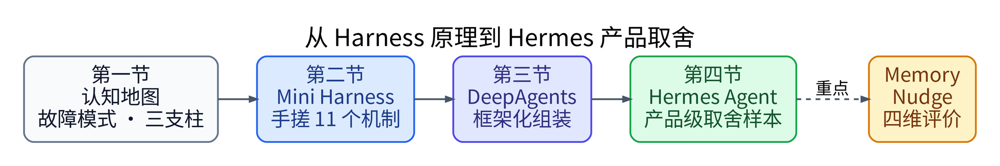</p>

Hermes 和 DeepAgents 的关系不要理解成“低级版 / 高级版”。更准确地说：

```text
DeepAgents：给你积木，让你自己决定怎样组装 Agent。
Hermes：把一组产品级取舍直接打包，让你研究“它为什么这样选”。
```

这节课最值得研究的不是“功能多”，而是 Hermes 把 **Garbage Collection / 动态化** 推得非常深：长期记忆、运行中产 Skill、后台清理、跨入口复用。代价则会在 Architectural Constraints 与入口治理上体现出来。

### 阅读导航

| 章节 | 核心问题 |
| --- | --- |
| 第 0 章 | Hermes 在 Harness 系列中的位置是什么？为什么不是 DeepAgents 升级版？ |
| 第 1 章 | 长对话和跨 Session 信息怎样存、怎样搜、怎样进入 Context？ |
| 第 2 章 | “creates skills from experience” 到底是怎样的一条工程链？ |
| 第 3 章 | 如何用 GC / AC / CE / Entry Governance 评价 Hermes 的取舍？ |
| 附录 A | Memory、Session Search、Skill 到底有什么区别？ |
| 附录 B | 课程 2026-05 口径与 2026-09 当前主分支有哪些重要变化？ |

---

# 第 0 章：从框架到产品——先摆正 Hermes 的位置

## 0.1 Hermes 不是 DeepAgents 的“升级版”

DeepAgents 是 batteries-included framework：它给出 Middleware、Backend、Subagent、HITL、Skills、Memory 等抽象，让工程师自己组合。Hermes 则已经选择了一套产品姿态：同一 Agent 跨多个入口运行、长期维护 Memory、运行中积累 Skill，并进一步依赖后台维护机制控制长期熵增。

所以学习 Hermes 的问题不是：

```text
“它是不是比 DeepAgents 更高级？”
```

而应该换成：

```text
“它把工程预算押在哪里？”
“为了这些能力，它牺牲了什么？”
```

## 0.2 本节真正要回答的三个问题

第一，**长对话与跨 Session 记忆怎样处理？** 课程给出的默认架构是热记忆 `MEMORY.md / USER.md` + 冷记忆 `SQLite + FTS5 双索引 + LLM retrieval summary`。

第二，**Skill 怎样从经验里长出来？** 源码并不是“模型突然想学习”，而是：

```text
Counter
→ Turn-end 判断
→ Fork Review Agent
→ 固定 Prompt 反思
→ PATCH / CREATE
→ 写 SKILL.md
```

第三，**这些能力在生产里到底是优势还是风险？** 这需要从功能清单升级到取舍分析，最终形成四维评价框架。

### 本章 Takeaways

1. Hermes 是产品级 Harness 样本，不是 DeepAgents 的“高级版”。
2. 本课重点不是再学一个框架 API，而是拆产品机制与工程取舍。
3. Memory、Nudge、四维评价是整节课的三条主线。
4. 后续每个机制都要问：解决什么 Failure Mode、怎样运行、代价是什么。

---

# 第 1 章：Hermes Memory——决定“什么信息何时进入 Context”

## 1.1 先把 Memory 问题拆成三层

很多 Agent 实现把 `messages` 直接理解成“记忆”。在单 Session、短任务里这没问题，但生产环境至少会遇到三个不同问题：

```text
① 存得住吗？
② 按内容找得到吗？
③ 找到以后，怎样以合适体积进入 Context？
```

Hermes 课程版本分别用：

```text
SQLite      → persistence
FTS5        → content retrieval
LLM summary → retrieved-result compression / synthesis
```

<p align="center">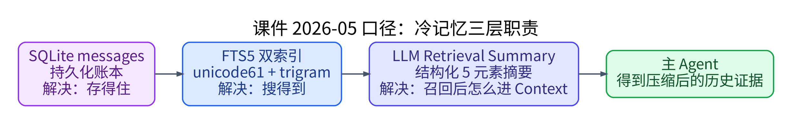</p>

这里要保留一个重要纠错：**DeepAgents 并不是“不能持久化”**。它通过 `Checkpointer` 解决 per-thread 续上，通过 `Store` 暴露 cross-thread 长期存储 contract；真正的差异是，课程所讨论的 Hermes 方案把“本地 SQLite + FTS5 keyword 全文检索 + 召回后归纳”整合成了一条具体产品链，而 DeepAgents 默认 Store 更通用，原生 summarization middleware 解决的是当前 Session Context 压缩，不是“检索历史以后再归纳”。

因此不要把两者说成：

```text
DeepAgents 没长期记忆
vs
Hermes 有长期记忆
```

更准确的是：

```text
两者都可以持久化。
Hermes 课程版本额外强调本地内容检索 + 召回后归纳的整合方案。
```

## 1.2 总架构：Hot Memory + Cold Memory + Opt-in Providers

<p align="center">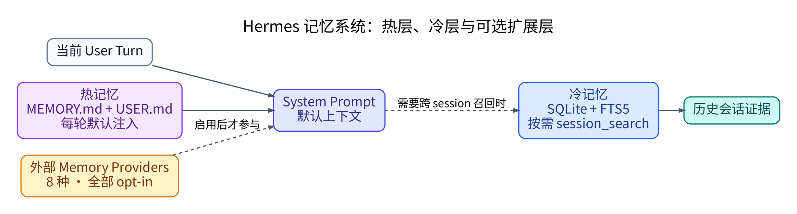</p>

### Hot Memory：默认就知道

`MEMORY.md` 与 `USER.md` 会被 Prompt Builder 整段拼进系统提示词，因此模型不需要 Tool Call 就能看到。

```text
Hot = 默认存在于当前 Context
```

`MEMORY.md` 更偏长期事实和稳定偏好；`USER.md` 更偏用户画像、沟通方式、技能水平等。但课程特别提醒：`USER.md` 的自动填充依赖外部 Honcho Provider，而 Honcho 默认关闭。因此“文件会被注入”与“文件里已经自动有完整画像”是两回事。

Hot Memory 的代价非常直接：

```text
文件越长
→ 每一轮 System Prompt 越长
→ 固定 Token 成本越高
→ 旧信息也更容易形成 Context 噪声
```

所以设计原则是：

```text
Hot memory 要短。
真正长的历史应该留在 Cold memory，按需查。
```

### Cold Memory：需要时才取

Cold Memory 指历史 Sessions 的持久数据。它不应该每轮全部塞进 Context，而是在 Agent 判断当前请求涉及过去会话时，通过 `session_search` 召回。

<p align="center">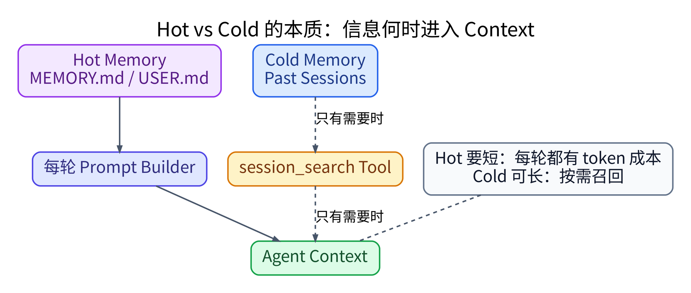</p>

这也是 Hot / Cold 最值得记住的区别：

```text
不是“一个重要、一个不重要”，
而是“一个每轮默认进入 Context，一个按需进入 Context”。
```

## 1.3 SQLite：Canonical Ledger，不是检索系统本身

课程中的 `messages` 表承担的是 durable source of truth：消息 ID、Session ID、Role、Content、Tool Name、Tool Calls、Timestamp 等数据都落在 SQLite 中，并通过 `(session_id, timestamp)` 一类索引支持按 Session 顺序读取。

SQLite 解决的是：

```text
进程退出以后，历史还在不在？
```

它并不自动解决：

```text
“几个月前我在哪个 Session 里讨论过 Kafka rebalance？”
```

如果只靠 `LIKE '%keyword%'` 全表扫描，数据规模上来以后会越来越差，所以 Hermes 加了 FTS5。

## 1.4 FTS5 双索引：写时全冗余，读时分流

课程版本维护两张 FTS5 影子索引：

- `messages_fts`：`unicode61`
- `messages_fts_trigram`：`trigram`

两张表并不是“写入时二选一”。同一条消息会通过 trigger 同步进入两套索引，真正的选择发生在查询时。

<p align="center">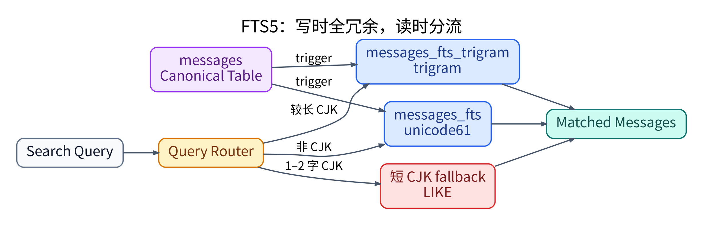</p>

因此可以记成一句：

```text
写时全冗余，读时分流。
```

`messages` 是 canonical table；FTS 表是 shadow index；`rowid` 把索引命中重新连接回真实消息。课程还强调 FTS tokenizer 是数据库字符串切分，不是 LLM 的 BPE / SentencePiece tokenizer，这两个“token”不能混。

### 为什么 Tool Call 也进入索引？

索引不只覆盖自然语言 `content`，课程实现还把 `tool_name / tool_calls` 一起纳入搜索，因此历史检索能命中“当时调用过什么工具、参数里出现过什么关键字”，这对 debugging 类 Session 很有价值。

### CJK fallback 的工程意义

课程版本为短 CJK Query 保留 `LIKE` fallback。最重要的不是死记字符阈值，而是理解：

```text
检索系统不能把“Tokenizer 不适配”误报成“历史不存在”。
```

所以生产检索要有 fallback route，并对 LLM 生成的 FTS 查询做 sanitize，避免保留字或特殊字符把工具直接打崩。

## 1.5 课程 2026-05 版本的 Retrieval Summary

课程版本在 FTS 命中以后增加 `_summarize_session`：把“命中的历史 transcript + 当前 query”交给辅助 LLM，压成固定 5 元素：

```text
1. 用户当时想完成什么
2. 实际采取了什么动作、结果如何
3. 关键决策 / 结论
4. 命令、文件、URL、技术细节
5. 未解决项 / 值得注意的事项
```

这样做的 Failure Mode 很明确：检索命中几十条消息以后，如果把全部原文继续塞给主模型，Cold Memory 虽然“搜到了”，Context 仍然会爆。

课程版本的工程特征包括并发摘要、失败重试、以及降级到 raw preview。这里最容易混淆的一点是：

```text
FTS 没命中
≠
LLM Summary 失败
```

只有后者才能 fallback 到 raw preview，因为前提是“历史材料已经找到了，只是摘要层挂了”。如果检索本身返回空集，就根本没有原文可 preview。

## 1.6 Agent 什么时候会调用 Cold Memory？

不要把触发条件理解成模糊的“模型觉得自己信息不够”。更具体地说，`session_search` 是一个专门的 past-conversation Tool；System / Tool Guidance 会把它定位为：当用户引用过去会话，或明显存在跨 Session prior context 时，用它先召回再回答。

典型信号包括：

```text
“我们上次怎么处理的？”
“remember when ...”
“last time ...”
“我之前说过的那个项目 ...”
```

因此这里更像 **Agentic Retrieval**：

```text
当前请求
→ 主 Agent 语义判断是否是 past-conversation recall
→ 是：Tool Call session_search
→ 否：不查历史
```

它不是一个独立 `memory_classifier()`，也不是硬编码 `confidence < 0.7` 就检索；最终 Tool Selection 仍由 LLM 在 Prompt / Tool Schema 约束下做。

## 1.7 如果 Cold Memory 找不到怎么办？

先区分“检索失败”和“没有证据”。技术层会通过多种检索路径尽量避免 tokenizer 导致的假空集；但如果仍然没有匹配，那么正确状态是：

```text
Memory has no evidence.
```

而不是：

```text
LLM 可以把常识猜测伪装成过去发生过的事实。
```

主 Agent可以换一个更合适的查询继续搜，也可以去真正的 source of truth（文件、URL、Live system、Web）取当前事实；但如果问题是“我上次跟你说了什么私人内容”，历史没命中以后 Web 根本无法补出来。

所以真正的多源路由应该是：

```text
过去会话事实      → session_search
当前公开信息      → web_search / web_extract
项目文件 / 本地状态 → file / terminal tools
私人历史且无证据   → 明确承认没有召回到
```

Cold Memory 只是一个数据源，不是“所有未知问题的万能 fallback”。

## 1.8 外部 Memory Providers：全部是 Opt-in Extension

课程列出 8 种外部 Provider：Honcho、Mem0、OpenViking、Hindsight、Holographic、RetainDB、ByteRover、Supermemory。学习这里最重要的不是背厂商，而是记住边界：

```text
这些 Provider 不是默认架构。
只有配置 memory.provider 后才会进入运行链路。
```

因此“默认就是四层记忆”“默认自带 Holographic”一类宣传表述需要谨慎理解。课程的默认口径仍然是 Hot Memory + Cold Session Store；外部 Provider 是扩展层。

### 第 1 章 Takeaways

1. Memory 不是一个组件，而是一条信息生命周期：存储、检索、压缩、注入 Context。
2. Hot / Cold 的关键区别是“何时进入 Context”，不是重要性高低。
3. SQLite 负责 durable ledger；FTS5 负责按内容召回；课程版本的 LLM summary 负责控制召回后的 Context 体积。
4. 双 FTS 索引是“写时全冗余、读时分流”，`messages` 才是 canonical source。
5. DeepAgents 与 Hermes 的准确差异不是“能否持久化”，而是具体整合方案与摘要时机。
6. `raw preview fallback` 只解决“已召回、摘要失败”，不解决“完全没召回”。
7. `session_search` 应被理解成 past-conversation evidence lookup，而不是所有未知问题的 fallback。
8. 8 种外部 Memory Provider 全部 opt-in；默认体验不能按宣传材料里的全部扩展能力来想象。

---

# 第 2 章：Nudge——Skill 的自动生产不是“模型自主进化”

## 2.1 Skill 从哪里来？

Hermes Skill 有 bundled、hub、user-created、agent-created 等来源。本章真正值得研究的是 `agent-created`：系统运行一段时间后，用户没有手写某个目录，但 `~/.hermes/skills/<name>/SKILL.md` 会出现新的 Skill。

最容易产生的误解是：

```text
Agent 做完任务以后突然“意识到自己学到了东西”，于是主动写 Skill。
```

源码实际是机械闭环：

<p align="center">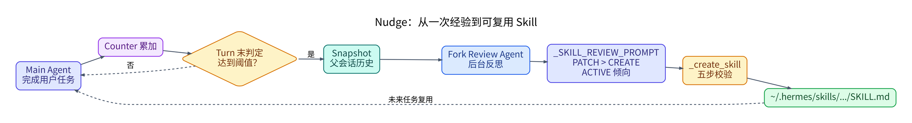</p>

所以必须把两个问题分开：

```text
什么时候学习？ → Python / Counter / Hook 决定
学什么？       → Review LLM 在 Prompt 约束下决定
```

## 2.2 两个计数器：Memory Nudge 与 Skill Nudge

Memory 与 Skill 不是同一个“学习对象”，因此 Hermes 使用不同颗粒度的计数器。

<p align="center">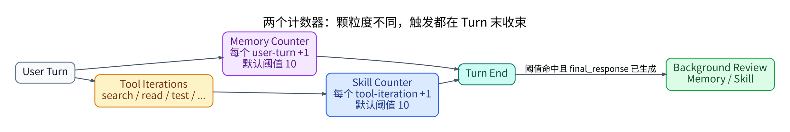</p>

### Memory Counter：按 User Turn

它更适合累计：用户偏好、长期事实、会话状态等信息。默认课程口径为每 10 个 user turns review 一次。

### Skill Counter：按 Tool Iteration

Skill 更关心 task execution experience。一个复杂 debugging turn 可能连续 search、read、grep、test、patch，多次工具迭代比“用户发了一句话”更接近实际工作量，因此 Skill counter 按 tool iteration 累加。

重要的是：

```text
1 user turn ≠ 1 unit of task experience
```

## 2.3 为什么达到阈值也不立刻打断当前任务？

Hermes 把真正触发放在 Turn 末。

如果在工具循环中间刚达到阈值就 review，Review Agent 看到的是半条 trajectory：Root Cause 可能还没找到，甚至当前假设最后会被推翻。Turn 末是天然的 episode completion boundary。

另一个原因是避免抢 foreground attention 与 provider capacity：用户任务先完成、Final Response 先交付，再做后台 reflection。

```text
Execution 先完成
→ Reflection 后发生
```

这是可以迁移到其他 Agent 系统的重要原则。

## 2.4 Fork Review Agent：为什么不让 Main Agent 顺手总结？

“做任务”和“反思任务”是两个不同目标。Hermes 用子 Agent 把它们隔开，并传入 Parent Conversation Snapshot，避免 Review Agent 自己的元对话污染主会话状态。

<p align="center">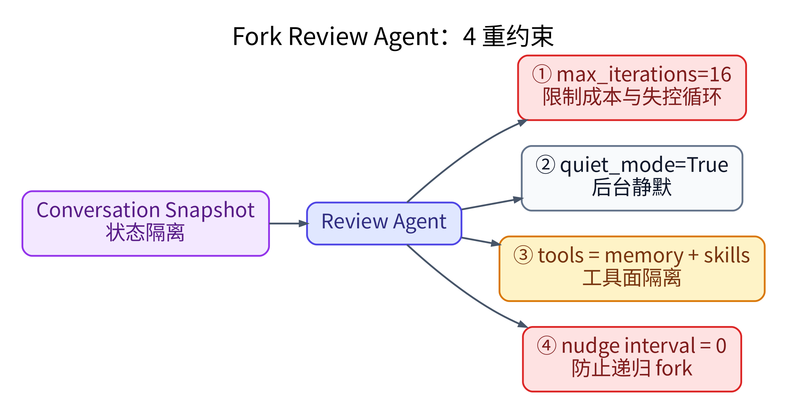</p>

四重约束分别是：

1. `max_iterations=16`：防止后台 review 无限消耗。
2. `quiet_mode=True`：不把后台反思噪声暴露给用户。
3. `enabled_toolsets=["memory", "skills"]`：不给 Web、Terminal、Messaging 等与反思无关的能力。
4. `_memory_nudge_interval=0` + `_skill_nudge_interval=0`：禁止 Review Agent 再触发 Nudge，避免递归 fork。

第四点尤其重要：所有能够 spawn 自己同类 meta-process 的系统，都必须显式设计 recursion boundary。

## 2.5 `_SKILL_REVIEW_PROMPT`：真正决定“学什么”的规则

Review Agent 不是自由发挥。课程源码中的 Prompt 明确给了偏好顺序：

```text
1. UPDATE 当前已经加载的 Skill
2. UPDATE 现有 umbrella Skill
3. 给现有 Skill 添加 support file
4. 最后才 CREATE 新的 class-level Skill
```

也就是：

```text
PATCH > CREATE
```

<p align="center">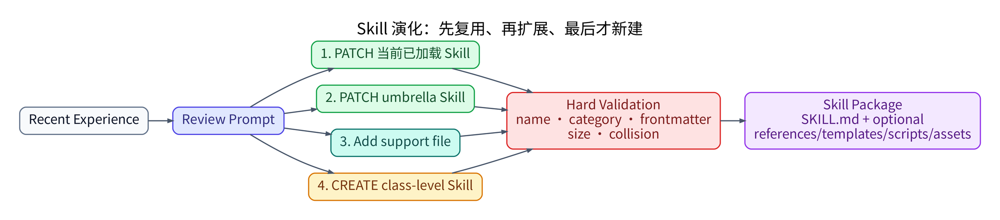</p>

这个顺序的目的，是让 Skill Library 发生 **evolution**，而不是每次 review 都新建一份重复文档。

### ACTIVE Bias：Nudge 的双刃剑

Prompt 同时告诉 Review Agent：`Nothing to save.` 是合法结果，但不应该成为默认；多数 Session 应该尝试找到可保存的学习机会。

这等于主动提高“学习召回率”，但会同时提高 False Positive：

```text
没有真正可复用的新经验
→ 为了“积极学习”硬抽象一条 Skill
→ 低质量知识被持久化
```

因此 Nudge 与后续 Curator 是联动设计：前者积极产出，后者承担长期清理压力。

## 2.6 Memory 与 Skill 学到的东西完全不同

Memory 更接近 episodic / factual retention：

```text
“上次 Kafka rebalance 的根因是处理时间超过 max.poll.interval。”
```

Skill 则应该完成 generalization：

```text
“排查 Kafka rebalance 时，检查 group log、session timeout、max.poll.interval，
并将最长 message processing latency 与 poll interval 对比；
如果调用慢速外部 API，优先检查处理时长。”
```

前者是：

```text
发生过什么？
```

后者是：

```text
以后这一类问题应该怎么做？
```

这就是从 episodic experience 到 procedural knowledge 的转换。

## 2.7 LLM 想写，不等于系统就直接写

Prompt Rule 是 Soft Constraint。Hermes 在 `_create_skill` 里还有 Hard Validation：name、category、frontmatter、content size、naming collision。

```text
Prompt：请遵守格式与复用原则
↓
LLM Proposal
↓
Python Validator：不合法就拒绝
```

这是生产 Agent 最值得借鉴的原则之一：

```text
重要规则不能只写在 Prompt 里。
```

Frontmatter 不是格式洁癖。`name + description` 是 Skill 的 Progressive Disclosure metadata：Agent 先看摘要决定是否需要加载 body。没有有效 metadata 的 Skill，即使文件存在，也可能无法进入正常的 Skill discovery 流程。

一个复杂 Skill 还可以包含：

```text
SKILL.md
references/
templates/
scripts/
assets/
```

因此 Skill 更像一个 reusable capability package，而不只是“一段 Prompt”。

## 2.8 Provenance：自动化必须知道哪些对象归自己管

课程提到 `skill_provenance.py` 用来区分 agent-created 与 human-created。这样后续 Curator 做合并/清理时，可以只动自动产物，不把用户手写 Skill 当“垃圾”误处理。

这体现一个通用治理原则：

```text
自动维护系统
必须知道对象的来源、所有权和可变更边界。
```

## 2.9 无 Explicit Consent：自动化与治理的直接 Trade-off

Nudge 的默认体验是 user out of the loop for improvements：计数器触发以后，Fork Agent 可以直接 PATCH / CREATE Skill，用户并不会在每次写入前收到 Y/N 确认。

这带来非常顺滑的持续学习体验，但风险也更高：一次错误经验如果被写成 Skill，就可能从 one-off hallucination 变成 persistent behavioral bias。

严格环境可以把 Nudge 完全关掉：

```yaml
skills:
  creation_nudge_interval: 0

memory:
  nudge_interval: 0
```

这也是 Architectural Constraints 里的典型取舍：

```text
Autonomy ↑ / Friction ↓
通常意味着
Human Control ↓ / Governance Requirement ↑
```

## 2.10 它到底算不算“学习”？

Hermes 并没有修改 Model Weights，也不是 Fine-tuning / RL。

<p align="center">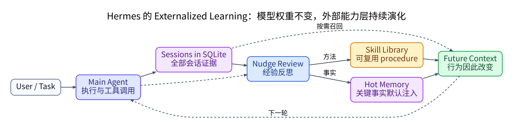</p>

传统 ML Learning：

```text
Experience
→ Training
→ Weight Change
→ Behavior Change
```

Hermes 更接近 Externalized Learning：

```text
Experience
→ Reflection
→ Memory / Skill Artifact Change
→ Future Context Change
→ Behavior Change
```

所以“creates skills from experience”可以成立，但要准确理解成：**Harness 层的外部能力库在进化，不是基础模型参数在自我训练。**

## 2.11 Demo 与测试真正验证什么

课程后半用 LangChain `AgentMiddleware + @tool + create_agent` 复现 Hermes 核心链路。学习重点不是背 Demo，而是确认每个 Contract 真能被工程化：Counter 会不会正确累加、阈值会不会触发、`interval=0` 能不能硬禁用、Tool Isolation 是否成立、Skill 是否真的落盘、完整链路是否能从 Review Agent 的 Tool Call 到达 `write_skill`。

这对应两层测试方法：

```text
Component Tests
→ 精确验证 Counter / Trigger / Tool / File 等局部契约

E2E Test
→ 验证 Spawn Review → Agent → Tool Call → SKILL.md 的完整组装
```

E2E 能证明系统整体“跑通”，Component Test 则负责出错时告诉你究竟哪个部件坏了。

### 第 2 章 Takeaways

1. Nudge 不是模型自主产生“学习意愿”，而是 Counter + Hook 强制触发 Reflection。
2. Memory Nudge 与 Skill Nudge 的计数颗粒度不同：user-turn vs tool-iteration。
3. Review 放在 Turn 末，是为了看到完整 trajectory，并避免和 foreground execution 抢 attention。
4. Fork Review Agent 用步数上限、quiet mode、Tool Isolation、防递归四重约束控制边界。
5. `PATCH > CREATE` 让 Skill Library 演化，而不是无界膨胀。
6. ACTIVE bias 提高学习机会，也提高低质量 Skill 风险。
7. Memory 保存“发生过什么”，Skill 抽象“以后这一类任务怎么做”。
8. Prompt 是 Soft Constraint；name/frontmatter/size/collision 等必须用代码做 Hard Constraint。
9. Agent-created provenance 是 Curator 能安全治理自动产物的前提。
10. Hermes 的“学习”是 Externalized Learning：Artifact 改变 → Context 改变 → 行为改变。

---

# 第 3 章：从“会用”到“会评价”——3 问 + 四维框架

第 3 章几乎不增加新机制，而是把前两章的证据换成评价坐标系。真正要问的不是“有没有 Skill / Sandbox / Memory”，而是：**系统把工程预算押在了哪里？**

## 3.1 3 问评价法

先问三个问题：

```text
① 能力怎么增长？
② 风险怎么控制？
③ 入口怎么组织？
```

分别对应：

| 工程问题 | 评价维度 | 白话理解 |
| --- | --- | --- |
| 能力怎么增长 | Garbage Collection / 动态化 | 靠人写死，还是系统运行中自己维护 Memory / Skill / Cleanup |
| 风险怎么控制 | Architectural Constraints | 靠 Agent 自觉，还是用 Sandbox / Permission / Worktree / Checkpoint / Tool Boundary 限制后果 |
| 入口怎么组织 | Entry Governance | 多入口的 Identity / Authorization / Audit 是否统一治理 |
| 信息怎么进入模型 | Context Engineering | 哪些信息默认进入、哪些按需检索、怎样压缩、固定成本多大 |

<p align="center">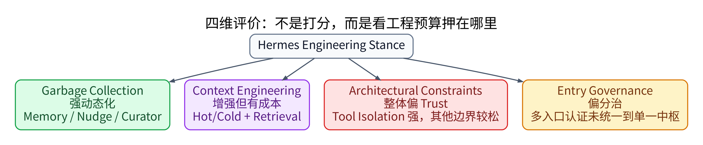</p>

注意：这不是打分表。一个维度“更强”并不自动等于产品“更好”。它只描述工程姿态是否匹配你的 Use Case。

## 3.2 Garbage Collection：Hermes 为什么偏动态端？

课程里的 GC 不是 Python / JVM 的内存垃圾回收，而是系统是否能持续熵减、自维护和动态增长。

静态端更像：

```text
工程师手写配置
工程师手写 Skill
工程师手动整理长期知识
```

Hermes 则把很多动作动态化：Memory 累积、Nudge 产 Skill、后续 Curator 清理，且同一 Agent 的这些能力可以跨多个入口复用。

因此“平台多”本身不是 GC 强的原因。真正重要的是：

```text
能力在 Agent 层增长，
而不是被锁死在某个 UI / Channel 里。
```

动态化的代价也必须同时看到：自动增长也会自动增长错误，GC 越强，对 Provenance、Curator、质量治理的要求越高。

## 3.3 Architectural Constraints：Hermes 是“没约束”吗？

不能这样简化。课程结论是：**整体偏 Trust 端，但不同子维度差异明显。**

### 相对弱的三处

第一，课程认为 Hermes 没有达到 native OS-level sandbox 的最硬隔离档。Docker、SSH、Modal 等能提供执行环境隔离，但与严格的系统级能力白名单不是同一层次。

第二，没有默认给每一个 `delegate` 出来的 Subagent 自动创建独立 Worktree。要注意这不等于 Hermes 完全没有 Worktree：系统层可以有 CLI Session Worktree / Dispatcher Worktree；缺的是 **per-delegate-subagent automatic worktree**。

第三，有 filesystem checkpoint / rollback，但不是每一个 LLM reasoning step 都无条件做完整状态 checkpoint。因此能回滚文件变更边界，不等于可以把整个 Agent reasoning state 精确恢复到任意中间步。

### 反而很强的一处：Tool Isolation

Hermes 对某些子 Agent 的 Tool Surface 做了明确缩减。第 2 章 Nudge Review Agent 只得到 `memory + skills` 就是最直观例子。

```text
Prompt 说“不要用 Terminal”
<
Tool Schema 里根本没有 Terminal
```

后者才是真正的 Capability Boundary。

所以正确总结是：

```text
Sandbox / per-subagent Worktree / reasoning-step Checkpoint：相对弱
Tool Isolation：强
综合姿态：偏 Trust，但不是“没有 AC”
```

## 3.4 Entry Governance：为什么多入口还要单独评价？

三支柱主要描述单个 Agent 内部工程姿态；但一个 Product Harness 可以同时从 IDE、Slack、Feishu、Telegram、API、Cron 等入口进入同一 Agent，于是 Identity / Permission / Audit 变成单独问题。

先记一个简单区分：

```text
MCP 连 Tool
ACP 连 Agent
```

课程源码口径里，Hermes 有 ACP runtime credential、各 Messaging Platform 自己的 Bot Token / OAuth / Webhook，以及用户级 DM Pairing 等不同认证路径。问题不是“没有认证”，而是这些入口没有统一抽象成单一 Identity / Authorization / Audit 中枢。

<p align="center">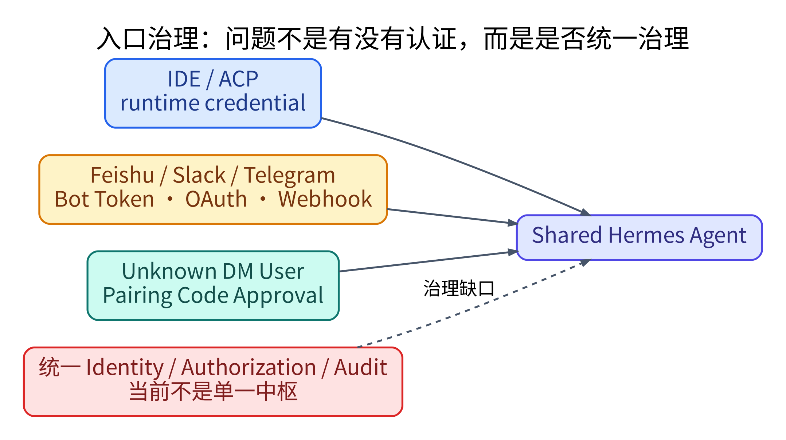</p>

这里也要避免另一个误解：

```text
入口分治 ≠ 架构差
```

成熟系统当然应该让 Slack Adapter、Telegram Adapter、Feishu Adapter 模块化。真正要评价的是：实现可以分治，但 **身份、权限、审计是否还能统一治理**。

## 3.5 Context Engineering：为什么“增强”仍然有代价？

第 1 章的 Hot / Cold Memory、FTS5、按需 Session Search，本质上都属于 Context Engineering：

```text
什么信息进入？
什么时候进入？
进入多少？
怎样检索？
怎样压缩？
```

Hermes 在 CE 上投入很深，但 Hot Memory 越长、Tool Schema 越多、固定 Prompt 越重，永久 Token Cost 就越高。

所以 CE 的目标始终不是：

```text
把所有信息都给模型
```

而是：

```text
Minimum Sufficient Context
```

## 3.6 四维位置图应该怎样读？

课程最终对 Hermes 的描述可以压缩成：

```text
GC：强动态化
CE：增强，但有固定成本
AC：整体偏 Trust，Tool Isolation 是强项
Entry Governance：多入口但偏分治
```

这不是优缺点计分，而是 Product Fit 问题。个人本地 Agent 可以容忍较松 AC，换来更流畅自动化；高度合规、多用户、能操作生产系统的 Agent，则自然会要求更强 Sandbox、Permission、Worktree、Audit、Unified Identity。

真正可迁移的评价动作是：

```text
看到任何 Harness：

1. 它的能力怎么增长？
2. 它的信息怎样进入 Context？
3. 它犯错时，架构怎样限制后果？
4. 多入口用户的身份、权限、审计怎样统一？
```

回答这四个问题，比数“支持多少 Tool、多少平台、有没有 Skill”更接近真正的 Agent System Architecture。

### 第 3 章 Takeaways

1. 四维框架是工程取舍坐标，不是评分表。
2. Garbage Collection 看的是能力是否能运行中自维护与动态增长，不是内存 GC。
3. Hermes GC 强的核心是 Memory / Skill 能长期积累并跨入口复用，不是平台数量本身。
4. Architectural Constraints 要分子维度看，不能用“有 / 没有”一句话判断。
5. Hermes 有 Worktree 与 Filesystem Checkpoint，但课程比较的缺口是 per-delegate worktree 与每 reasoning step 的完整 checkpoint。
6. Tool Isolation 是 Hermes AC 的强项。
7. Entry Governance 关注统一 Identity / Authorization / Audit，不等于“模块是否分开”。
8. Context Engineering 的目标仍是 Minimum Sufficient Context，而不是更多 Context。
9. 最终要做的是 Use Case → Risk / Cost → Harness Stance Matching，而不是寻找绝对“最强框架”。

---

# 附录 A：三个最容易混淆的长期知识对象

## A.1 Memory vs Session Search vs Skill

| 对象 | 主要回答的问题 | 典型内容 | 进入 Context 的方式 |
| --- | --- | --- | --- |
| Hot Memory | 有哪些关键事实应该一直知道？ | 用户偏好、长期事实、稳定状态 | 每轮默认注入 |
| Session Search | 过去某次会话具体发生了什么？ | 历史对话、具体命令、当时决策 | 按需 Tool Retrieval |
| Skill | 以后这一类问题应该怎么做？ | 可复用 Procedure / Checklist / Scripts | 通过 Skill metadata 选择后加载 |

一句话记忆：

```text
Memory = 事实
Session Search = 证据
Skill = 方法
```

## A.2 Cold Memory 没找到 ≠ 可以猜过去

```text
No Search Evidence
≠
Past Fact is false
≠
LLM may invent the past
```

如果问题可以从当前 Web / 文件 / Live System 得到答案，就切到对应 Source of Truth；如果问题本质是私人历史，而 Session Store 也没召回到，就应该明确说没有证据。

## A.3 Reflection vs Training

```text
Hermes Nudge
不是 Fine-tuning
不是 Weight Update
不是 RL

它改变的是：Memory / Skill / Future Context
```

---

# 附录 B：版本漂移提醒——课程 2026-05 vs 当前 2026-09 主分支

这部分不是用新版本“改写课程”，而是保留我们学习过程中已经核实过的版本变化，避免以后把课程源码行号当作永恒事实。

## B.1 课程版本：FTS5 命中后做 LLM Retrieval Summary

课程第 1 章明确把冷层描述为：

```text
SQLite
→ FTS5
→ LLM 5 元素 Summary
```

并讨论并发、重试、raw preview fallback。这是 **2026-05 课程源码口径**，应保留在主线里。

## B.2 当前主分支：`session_search` 已改为直接返回实际 DB Messages

我们在 **2026-09-25** 复核当前 Hermes 主分支文档与 `tools/session_search_tool.py`：当前 `session_search` 明确写的是 **No LLM calls**，返回 SQLite 中的真实消息视图。

<p align="center">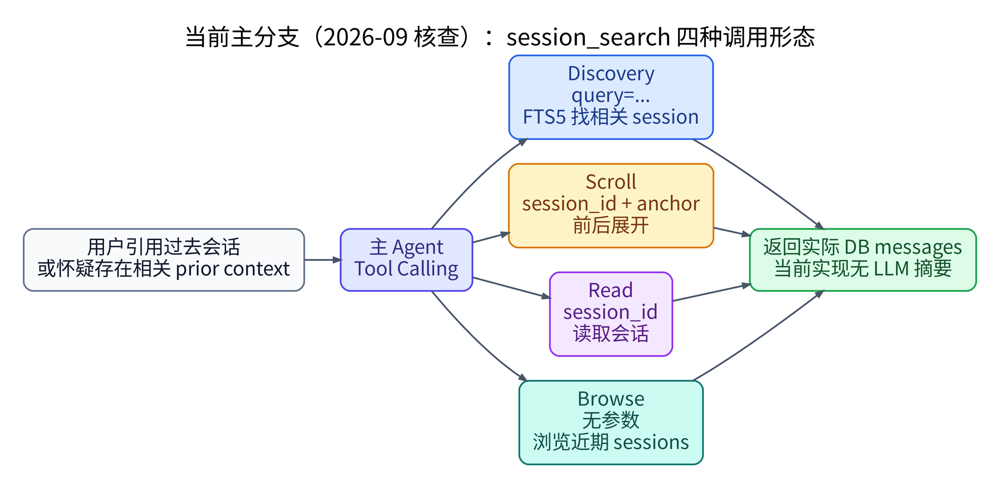</p>

当前工具有四种调用形态：

```text
Discovery：query=... → FTS5 找 Session
Scroll：session_id + around_message_id → 围绕命中点前后展开
Read：session_id → 读取一个 Session
Browse：无参数 → 浏览近期 Sessions
```

这说明 Memory 系统的工程方向在变化：课程版本倾向“检索层先摘要”，当前版本更倾向“检索层返回真实证据，由主 Agent 自己理解”。

因此以后复习时要分清：

```text
课程要学的是设计思想与当时实现；
当前 API / Tool Shape 必须按当前源码重新核。
```

当前核查来源：
- Hermes `tools/session_search_tool.py`
- Hermes `website/docs/user-guide/sessions.md`
- Hermes `website/docs/reference/tools-reference.md`

---

# 附录 C：整节课压缩成一张生命周期图

<p align="center"></p>

这张图把第 1、2 章串成一个统一模型：

```text
所有 Session 证据进入 SQLite
↓
少量关键事实被提升为 Hot Memory
↓
具体历史需要时再 Session Search
↓
有复用价值的执行经验经 Nudge 抽象成 Skill
↓
未来 Prompt / Context / Tool Strategy 因此发生变化
```

真正的 Harness Learning 发生在 **外部状态和 Context 层**。

---

# 最终十五句话

1. **Hermes 不是 DeepAgents 的升级版，而是另一种产品级 Harness 取舍。**
2. **Memory 的核心问题不是“有没有历史”，而是哪些信息何时进入 Context。**
3. **Hot Memory 默认注入；Cold Memory 按需检索。**
4. **SQLite 解决持久化，FTS5 解决内容召回；两者不要混成一个能力。**
5. **课程版本的 Retrieval Summary 与当前主分支的 actual-message retrieval 是版本差异，不是概念矛盾。**
6. **FTS5 双索引的核心是写时全冗余、读时分流。**
7. **Cold Memory 是 past-conversation evidence source，不是所有未知问题的 fallback。**
8. **Nudge 的“什么时候学”由 Counter/Hook 决定，“学什么”才交给 Review LLM。**
9. **Memory 记事实，Skill 学方法。**
10. **PATCH > CREATE 是控制 Skill Library 熵增的核心策略。**
11. **重要规则必须从 Prompt Soft Constraint 下沉到代码 Hard Constraint。**
12. **Hermes 的自学习是 Externalized Learning，不是模型权重自我训练。**
13. **Garbage Collection、Context Engineering、Architectural Constraints、Entry Governance 描述的是工程姿态，不是分数。**
14. **动态化越强，长期质量治理、Provenance 与 Cleanup 就越重要。**
15. **真正会看 Harness，不是问“它有多少功能”，而是问：能力怎么增长、Context 怎么组织、错误怎么被约束、入口怎么统一治理。**
